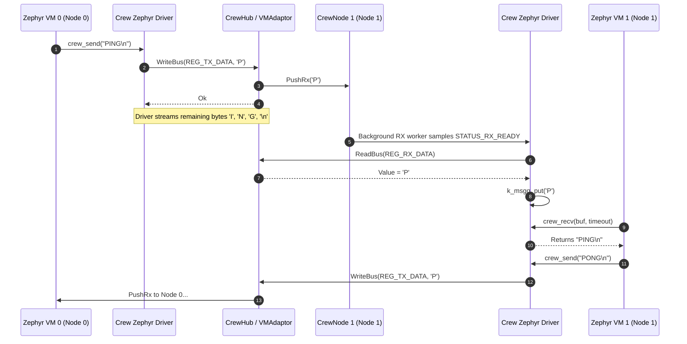

# Crew Architecture

## Purpose
## Purpose and System Role

`crew` is Trellis's virtual-machine co-simulation coordination framework. It interfaces with external VM emulators (such as Renode) over low-latency socket protocols and provides deterministic in-memory MMIO message dispatch, inter-VM packet routing, and execution telemetry.
`crew` is Trellis's virtual machine co-simulation coordination framework. It bridges virtual machine emulators (such as Renode or QEMU) and guest operating systems (such as Zephyr RTOS) to Trellis's cycle-accurate digital circuit models (`rube`) and high-speed in-memory routing fabrics (`karst`).

## Main building blocks
Crew enables heterogeneous multi-node systems — for instance, two dual-core or quad-core virtual machines running Zephyr — to communicate deterministically over simulated memory-mapped I/O (MMIO) peripherals, both across external network sockets and within native in-memory test harnesses.

- `CoSimAction` identifies socket protocol actions defined by Renode's `CoSimulatedPlugin` (bus reads, bus writes, handshakes, clock ticks, resets).
- `ProtocolMessage` is the fixed 24-byte packed payload exchanged between emulator sockets and the C++ co-simulation runtime.
- `REG_*` and `STATUS_*` define memory-mapped I/O (MMIO) register addresses and status flags for inter-VM communication.
- `ICrewNode` / `CrewNode` defines a virtual machine endpoint with thread-safe FIFO queues and telemetry counters.
- `CrewHub` provides in-memory MMIO message dispatch (`HandleRequest`), peer node routing, and execution telemetry without OS networking overhead.
```text
  +-----------------------------------------------------------------------+
  |                             Guest OS                                  |
  |             (Zephyr RTOS running on x86_64 / RISC-V)                  |
  +-----------------------------------+-----------------------------------+
                                      |
                      cooperative driver API (crew.h)
                                      |
                                      v
  +-----------------------------------------------------------------------+
  |                       MMIO Space: 0x50000000                          |
  |          (REG_NODE_ID, REG_STATUS, REG_TX_DATA, REG_RX_DATA)          |
  +-----------------+-----------------------------------+-----------------+
                    |                                   |
           (Renode Socket ABI)                 (Native In-Memory)
                    |                                   |
                    v                                   v
  +-----------------------------------+   +-------------------------------+
  |          ProtocolMessage          |   |            VMAdaptor          |
  |     (24-byte packed socket flit)  |   |     (Rube Coroutine Module)   |
  +-----------------+-----------------+   +---------------+---------------+
                    |                                     |
                    v                                     v
  +-----------------------------------+   +-------------------------------+
  |              CrewHub              |   |          Rube Netlist         |
  |   (Peer routing, telemetry,      |   |    (Valid/Ready streaming     |
  |    in-memory protocol dispatch)   |   |     inter-die Tiger-links)    |
  +-----------------------------------+   +-------------------------------+
```

## Communication flow
---

1. Virtual machine firmware (such as Zephyr OS on x86_64) performs 32-bit MMIO reads/writes to base address `0x50000000`.
2. MMIO accesses are formatted as 24-byte `ProtocolMessage` packets conforming to Renode's `CoSimulatedPlugin` ABI.
3. `CrewHub::HandleRequest` decodes the packet and executes the access:
   - Writing to `REG_TX_DATA` queues data into the destination peer's RX FIFO and triggers registered message callbacks.
   - Reading `REG_RX_DATA` pops bytes from the local node's RX FIFO.
   - Reading `REG_STATUS` exposes `STATUS_TX_READY`, `STATUS_RX_READY`, and `STATUS_PEER_UP`.
   - Reading `REG_NODE_ID` returns the current machine ID (e.g. 0 or 1).
4. `CrewHub` returns a response `ProtocolMessage` with action `Ok` and the requested register value.
## The Renode CoSimulation Protocol ABI

## Determinism & In-Memory Execution
To interoperate seamlessly with Renode's `CoSimulatedPlugin`, `crew` implements the exact packed socket protocol ABI required for hardware emulation co-simulation:

`CrewHub::HandleRequest` is decoupled from OS socket plumbing. This allows unit tests and embedded test harnesses to execute full dual-VM protocol exchanges deterministically in-memory without networking dependencies. For a detailed step-by-step trace and sequence diagram, see the [Virtual Exchange Protocol](virtual-exchange-protocol.md) wiki.
### 1. `ProtocolMessage` Structure
All socket communications are encoded into fixed 24-byte packets with 1-byte alignment (`#pragma pack(push, 1)`):

## Invariants
```cpp
struct ProtocolMessage {
    int32_t   _ActionId;        // Renode CoSimAction (e.g. ReadBus, WriteBus, Ok)
    uint64_t  _Addr;            // Physical MMIO target address
    uint64_t  _Value;           // Payload value (read data or write data)
    int32_t   _PeripheralIndex; // Peripheral instance index
};
static_assert(sizeof(ProtocolMessage) == 24, "ProtocolMessage must be exactly 24 bytes packed");
```

- `ProtocolMessage` is packed to exactly 24 bytes across all platforms.
- MMIO reads and writes update node telemetry (`_ReadsServiced`, `_WritesServiced`, `_BytesSent`, `_BytesReceived`) atomically.
- Peer routing is thread-safe and protected against queue starvation.
### 2. Supported `CoSimAction` Operations
`CoSimAction` defines standard bus operations supported by external emulators:
- **Handshake & Lifecycle**: `Handshake`, `Ok`, `Error`, `ResetPeripheral`, `Disconnect`.
- **Clock Coordination**: `TickClock`, `SingleStep`.
- **Bus Access**: `ReadBus` / `WriteBus`, with sized variants: `Byte` (8-bit), `Word` (16-bit), `Dword` (32-bit), and `Qword` (64-bit).

---

## MMIO Register Map (`0x50000000`)

The simulated Crew peripheral is mapped into the guest VM's physical address space at base address `0x50000000`:

| Register Offset | Constant | Type | Width | Description |
|---|---|---|---|---|
| `0x000` | `REG_NODE_ID` | RO | 32-bit | Node ID assigned to this VM endpoint (e.g., `0` or `1`). |
| `0x004` | `REG_STATUS` | RO | 32-bit | Status bitmask indicating transmitter and receiver readiness. |
| `0x008` | `REG_TX_DATA` | WO | 8-bit | Writing a byte pushes it into the peer VM's receive FIFO. |
| `0x00C` | `REG_RX_DATA` | RO | 8-bit | Reading a byte pops the oldest byte from this VM's receive FIFO. |
| `0x010` | `REG_RX_COUNT` | RO | 32-bit | Number of pending unread bytes in this VM's receive FIFO. |

### Status Register Bit Flags (`REG_STATUS`)

- **`STATUS_TX_READY` (`1U << 0`)**: Asserted when the local node is capable of accepting an outgoing byte (always 1 unless downstream fabric backpressures).
- **`STATUS_RX_READY` (`1U << 1`)**: Asserted when at least one byte is waiting in `REG_RX_DATA` (`REG_RX_COUNT > 0`).
- **`STATUS_PEER_UP` (`1U << 2`)**: Asserted when the target peer VM is registered, initialized, and marked online.

---

## In-Memory Coordination: `CrewHub` & `CrewNode`

`crew` decouples co-simulation mechanics from operating system networking. This permits high-speed, 100% deterministic testing of VM protocols entirely in memory.

### `CrewNode`
Represents an individual simulated VM endpoint:
- **RX FIFO**: Thread-safe queue (`std::deque<uint8_t> _RxQueue`) guarded by `stalks::Spinlock`.
- **Lifecycle**: Atomic online/offline status (`_IsOnline`).
- **Telemetry**: Tracks exact hardware interaction counts:
  - `_BytesSent`: Number of bytes written via `REG_TX_DATA`.
  - `_BytesReceived`: Number of bytes extracted via `REG_RX_DATA`.
  - `_ReadsServiced`: Total MMIO read requests processed.
  - `_WritesServiced`: Total MMIO write requests processed.

### `CrewHub`
The central exchange hub orchestrating message dispatch:
- **Zero-Network Execution**: `CrewHub::HandleRequest(CrewNode* node, const ProtocolMessage& req)` consumes a request flit, modifies target node state, and returns a response flit with `CoSimAction::Ok`.
- **Peer Forwarding**: Automatically routes TX writes to the opposite peer node (`peerId = 1 - node->Id()`).
- **Message Taps**: `SetMessageCallback(MessageCallback cb)` registers an inspection closure `(srcNode, dstNode, byte)` for real-time protocol monitoring and telemetry logging without altering simulation timing.

---

## Hardware Integration: `VMAdaptor` and `VMRunner`

For cycle-accurate simulation inside `rube` netlists, `crew` provides coroutine modules that translate guest VM actions into digital clock-cycle transactions:

### `VMRunner`
A `rube::CoroModule` that encapsulates a guest program's execution logic. It interacts with its local memory bus via standard ports:
- **Outputs**: `Req` (strobe), `Write` (read/write flag), `Addr` (32-bit address), `WData` (32-bit write payload).
- **Inputs**: `Ack` (bus acknowledge strobe), `RData` (32-bit read payload).

Convenience macros `VM_MMIO_WRITE` and `VM_MMIO_READ` wrap the zero-allocation `VmBus` helper to generate cycle-accurate bus handshakes.

### `VMAdaptor`
A hardware bridge module connecting a `VMRunner` to the digital interconnect:
- Connects local VM bus requests to MMIO registers.
- Converts `REG_TX_DATA` writes into valid/data/ready streaming link flits (`LinkTxValid`, `LinkTxData`, `LinkTxReady`).
- Buffers incoming stream flits (`LinkRxValid`, `LinkRxData`, `LinkRxReady`) into an internal FIFO mapped to `REG_RX_DATA`.
- Automatically deasserts `LinkRxReady` when internal queue limits are reached, applying backpressure to the upstream fabric.

---

## Zephyr RTOS Cooperative Device Driver

Trellis provides a formal Zephyr RTOS device driver implementation (`src/zephyr/drivers/crew/crew_driver.c`) conforming to Zephyr's standard driver model (`DEVICE_DT_DEFINE` / `struct crew_driver_api`):

```cpp
struct crew_driver_api {
    int (*send)(const struct device *dev, const uint8_t *data, size_t len);
    int (*recv)(const struct device *dev, uint8_t *buf, size_t max_len, k_timeout_t timeout);
    uint32_t (*get_node_id)(const struct device *dev);
    uint32_t (*get_status)(const struct device *dev);
};
```

### Cooperative Multi-Tasking Architecture
1. **Zero Busy-Waiting**: Replaces wasteful spinning (`k_busy_wait`) with cooperative yielding (`k_yield()` / `k_sleep(K_TICKS(1))`).
2. **Dedicated Background RX Worker**: A cooperative kernel thread running at `K_PRIO_COOP(2)` drains incoming bytes from `REG_RX_DATA` into a 256-byte Zephyr message queue (`k_msgq`).
3. **Flow Control & Concurrency**: Application threads (e.g. periodic telemetry/heartbeat workers running at `K_PRIO_COOP(5)`) interleave cleanly with ping-pong communication without thread starvation or race conditions.

---

## Communication Flow



---

## Invariants and Guarantees

1. **Strict 24-byte Packet Size**: All `ProtocolMessage` instances are statically asserted to 24 bytes across compilers, guaranteeing socket portability.
2. **Atomic Telemetry**: Every read and write through `CrewHub` or `VMAdaptor` increments exact metric counters atomically without data races.
3. **Queue Integrity & Backpressure**: Receive queues enforce strict FIFO ordering. When queues are full, upstream modules are backpressured via deasserted ready lines.
4. **Deterministic In-Memory Replay**: The in-memory execution path executes identically to socket-driven Renode execution, allowing deterministic debugging of firmware race conditions.
