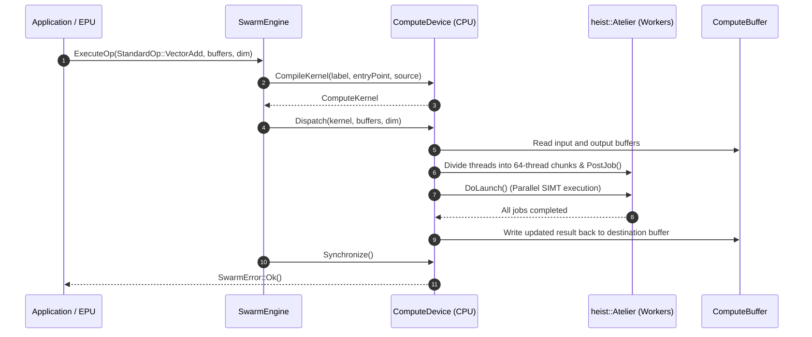

# Swarm Architecture

## Purpose
## Purpose and System Role

`swarm` is Trellis's backend-neutral compute execution API. It presents buffers, compiled kernels, devices, workgroup dimensions, and structured errors through interfaces, then supplies a working CPU backend and placeholders for GPU backends.
`swarm` is Trellis's backend-neutral compute execution framework. It presents a unified, hardware-agnostic SIMT (Single Instruction, Multiple Threads) compute API modeling modern graphics and compute execution pipelines (such as WebGPU, Vulkan/SPIR-V, and CUDA/PTX) while providing a high-performance multi-threaded CPU reference implementation backed by Trellis's `heist` work-stealing job scheduler and `symph` mathematical kernels.

## Main building blocks
In Trellis's layered system, `swarm` sits between high-level numerical/compute applications (including near-memory compute in `karst`) and raw compute backends:

- `BackendKind` identifies CPU, Rust GPU, and Cuda/Oxide backends.
- `BufferUsage` describes how a compute buffer may be used, such as storage and read/write access.
- `WorkgroupDim` describes the dispatch shape, including linear work.
- `IComputeBuffer` is the byte-oriented buffer interface: size, label, write, and read.
- `IComputeKernel` is the compiled-kernel interface: name and backend identity.
- `IComputeDevice` owns buffer creation, kernel compilation, dispatch, and synchronization.
- `CpuDevice`, `CpuBuffer`, and `CpuKernel` implement the executable reference backend.
- `SwarmEngine` owns or selects a device and maps `StandardOp` values to Symph operation labels/source and dispatch calls.
- `SwarmError` carries typed failure information, including unsupported backends, invalid sources, invalid arguments, and execution errors.
```text
       +-----------------------------------------------+
       |             Applications & Near-Memory        |
       |           Compute (e.g. Karst EPU/VPU)        |
       +-----------------------+-----------------------+
                               |
                               v
       +-----------------------------------------------+
       |                 swarm API                     |
       |  (SwarmEngine, ComputeDevice, ComputeBuffer,  |
       |   ComputeKernel, KernelSource, WorkgroupDim)  |
       +-------+---------------+---------------+-------+
               |               |               |
               v               v               v
       +---------------+---------------+---------------+
       |   CPU SIMT    |   Rust-GPU    |  CUDA / PTX   |
       |  (Reference)  | (WebGPU/WGSL) | (NVIDIA PTX)  |
       |   heist pool  | SPIR-V (Stub) |  (Stub API)   |
       |   symph ops   |               |               |
       +---------------+---------------+---------------+
```

## Dispatch flow
---

1. The caller creates a `SwarmEngine` for a backend.
2. The device creates initialized or empty buffers from byte views (`silo::Arr<const uint8_t>`).
3. A standard or backend-specific kernel is compiled from a label and source description.
4. The caller supplies an array of `IComputeBuffer*` and a `WorkgroupDim` to dispatch.
5. The backend executes the kernel and reports a `SwarmError` status.
6. The caller reads a copied byte buffer and interprets it according to the operation's data contract.
## Supported Backends

The CPU backend maps standard operations to Symph's element-wise functions. Parallel execution can use `heist::Atelier`, while the buffer API remains backend independent.
The runtime represents target execution hardware via the `BackendKind` enum:

## Backend strategy
| Backend | Target Runtime / Hardware | Shader / Code Format | Implementation Status |
|---|---|---|---|
| `BackendKind::Cpu` | Multi-core host CPU via `heist::Atelier` | C++ lambda / `CpuKernelFn` closure | **Full Reference Runtime** |
| `BackendKind::RustGpu` | WebGPU / Vulkan / SPIR-V | WGSL / SPIR-V bytecode | Contract stub (returns `UnsupportedBackend`) |
| `BackendKind::CudaOxide` | NVIDIA GPUs / CUDA Driver | NVIDIA PTX assembly | Contract stub (returns `UnsupportedBackend`) |

The interfaces establish the stable contract for future devices. The Rust GPU and Cuda/Oxide implementations currently provide identity objects and return `UnsupportedBackend` from operations that are not implemented. This allows backend selection and API integration to be tested before native device runtimes exist.
### Stub Backend Strategy
To allow top-level code to target future hardware without maintaining external driver dependencies, non-CPU backends strictly uphold the interface contract: buffers and kernels can be created or queried, and execution calls gracefully fail with typed, structured errors (`SwarmError::UnsupportedBackend`) rather than panicking or crashing.

## Memory and ownership
---

Devices return `std::unique_ptr` instances for buffers and kernels, making lifetime explicit. `Write` consumes a non-owning byte view; `Read` returns an independent `silo::Buff<uint8_t>` copy. Callers therefore cannot accidentally retain a view into a device's mutable storage.
## Core Abstractions

## Dependencies and consumers
### 1. `BufferUsage`
Bitmask flags describing access permissions and hardware memory placement:

`swarm` depends on `silo` for byte views and owned readback, `symph` for standard operations, and optionally `heist` for parallel CPU execution. It is intended to sit between application code and backend-specific compute implementations.
```cpp
struct BufferUsage {
    static constexpr BufferUsage Storage();    // General read/write SSBO
    static constexpr BufferUsage Uniform();    // Uniform / constant memory
    static constexpr BufferUsage ReadOnly();   // Host/Kernel read-only
    static constexpr BufferUsage ReadWrite();  // Read-write access
    static constexpr BufferUsage CopySrc();    // Buffer copy source
    static constexpr BufferUsage CopyDst();    // Buffer copy destination
};
```

## Invariants
### 2. `WorkgroupDim`
A 3D structure specifying grid and workgroup dispatch geometry:
- Coordinates: `_X`, `_Y`, `_Z` (defaults to `1, 1, 1`).
- Helper: `WorkgroupDim::Linear(x)` creates a 1D grid `[x, 1, 1]`.
- Total work items: `Total() = _X * _Y * _Z`.
- Under the CPU backend, workgroups map to hardware threads where each workgroup tile processes a 64-thread warp: `threadsX = _X * 64`.

- Buffer and kernel objects report the backend that created them.
- Dispatch receives buffers in the order required by the selected operation.
- Readback is an owned copy and is stable after subsequent device writes.
- Unsupported backends fail through typed errors rather than silently claiming success.
### 3. `ComputeBuffer` (`CpuBuffer`, `IComputeBuffer`)
Encapsulates linear contiguous memory backed by `silo::Buff<uint8_t>`:
- Thread-safe access protected by an internal `stalks::Spinlock`.
- `Write(silo::Arr<const uint8_t> data)`: Dynamically resizes if necessary and copies bytes into device memory.
- `Read()`: Returns an **independent owned copy** (`silo::Buff<uint8_t>`), guaranteeing that host callers cannot retain dangling or racy views into active device storage.
- Tracks assigned `BackendKind`, `BufferUsage`, byte size, and debug label.

### 4. `KernelSource` & `ComputeKernel`
Represents compiled or callable compute routines:
- `KernelSourceKind`: `Wgsl`, `SpirV`, `Ptx`, or `CpuClosure`.
- `CpuKernelFn`: Typed closure signature:
  ```cpp
  using CpuKernelFn = std::function<void(
      silo::Arr<silo::Arr<const uint8_t>> inputs,
      silo::Arr<silo::Arr<uint8_t>> outputs,
      uint32_t gidX, uint32_t gidY, uint32_t gidZ
  )>;
  ```
- `ComputeKernel`: Holds the kernel entrypoint name, backend association, and execution closure.

### 5. `SwarmError`
Structured error model replacing raw return codes:
- `SwarmErrorKind`: `None`, `DeviceUnavailable`, `CompilationError`, `BufferError`, `ExecutionError`, `UnsupportedBackend`, `InvalidKernelSource`.
- Convenience checks: `IsOk()` and `IsError()`.

---

## Execution Engine: `ComputeDevice` and `SwarmEngine`

### Dispatch Mechanics (`ComputeDevice::Dispatch`)

When a kernel is dispatched on the CPU backend:
1. **Buffer Staging**: Buffer handles are gathered; input slices (`silo::Arr<const uint8_t>`) and output slices (`silo::Arr<uint8_t>`) are staged into local working buffers.
   - If a single buffer is passed, it is treated as read-write (both input and output).
   - If multiple buffers are passed, buffers `0..N-2` are inputs, and buffer `N-1` is the writeable destination.
2. **Parallel Scheduling via Heist**:
   - Total threads are calculated: `threadsX = dim._X * 64`, `threadsY = dim._Y`, `threadsZ = dim._Z`.
   - If `heist::Atelier` has more than 1 thread and is not in immediate mode, work is divided into chunks of 64 threads along the X dimension.
   - Chunks are packaged into `stalks::WorkPtr::FromLambda` jobs and posted across `heist::Maestro` worker threads.
   - The thread pool runs via `Atelier::DoLaunch()`, waiting for all threadblocks to retire.
3. **Serial Fallback**: If running on a single thread or in immediate mode, a triple-nested loop executes all `(x, y, z)` invocations synchronously.
4. **Output Commit**: The final results are committed back into the target `ComputeBuffer`.



---

## Standard Compute Operations (`StandardOp`)

`swarm` provides built-in multi-platform implementations for core operations. Each operation supplies WGSL compute shaders, PTX assembly stubs, and exact element-wise CPU implementations delegating to `symph`:

| StandardOp | Description | WGSL Function | PTX Entry | Symph Implementation |
|---|---|---|---|---|
| `Double` | In-place element scaling: `x = x * 2.0` | `double_cs` | `double_kernel` | `symph::DoubleElem` |
| `VectorAdd` | Element-wise vector addition: `C = A + B` | `vecadd_cs` | `vecadd_kernel` | `symph::VectorAddElem` |
| `Collatz` | Step count evaluation of the $3n + 1$ conjecture | `collatz_cs` | `collatz_kernel` | `symph::CollatzElem` |
| `PointCloud` | Procedural Wang-hash pseudo-random 3D points | `pts_pointcloud_cs` | `pointcloud_kernel` | `symph::PointCloudElem` |
| `CameraTransform` | 3D perspective projection, rotation, pan, zoom, & sorting | `camera_transform_cs` | `camera_transform_kernel` | `symph::CameraTransformElem` |

### Detailed Example: `CameraTransform`
The `CameraTransform` kernel computes the full projection matrix and visual attributes for a 3D point cloud:
- **Inputs**:
  - `in_points`: Array of float 3-tuples `[x, y, z]`.
  - `cam_params`: 13-element float array containing camera parameters (`rot_x`, `rot_y`, `zoom`, `pan_x`, `pan_y`, `fov`, `distance`, `width`, `height`, center `cx`, `cy`, `cz`, and `scale_norm`).
- **Outputs**:
  - `out_projected`: Packed 6-element float tuples for each point: `[proj_x, proj_y, radius, core_radius, alpha, depth_factor]`.
- Matches bit-for-bit across CPU SIMD and GPU shader pipelines.

---

## Memory and Invariants

1. **Ownership**: `ComputeDevice` creates objects returning `std::unique_ptr<ComputeBuffer>` and `std::unique_ptr<ComputeKernel>`, establishing explicit resource ownership.
2. **Zero Dangling Pointers**: Buffer readback produces independent copies (`silo::Buff<uint8_t>`), preventing race conditions when device memory is mutated by subsequent dispatches.
3. **Deterministic Execution**: CPU dispatches in single-worker mode produce bitwise identical results to multi-threaded `heist::Atelier` work-stealing execution.
4. **Backend Fidelity**: Kernels and buffers permanently retain the `BackendKind` that created them and reject cross-backend dispatches.
