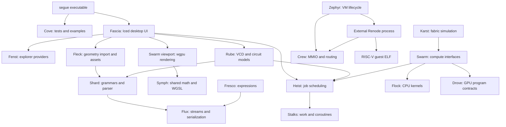

# Segue architecture and folder guide

Reviewed against the repository source on 2026-09-21. This document describes the current implementation; planned capabilities are identified explicitly. Here, a module's **framework** means its abstractions, execution model, dependencies, and integration boundaries, including custom frameworks built inside Segue.

## 1. High-level architecture

Segue is a Rust systems and algorithms framework with a native desktop workbench. It combines custom storage, parsing, serialization, scheduling, compute, geometry, circuit simulation, and guest-machine co-simulation in one library. The executable exposes the desktop application and the project's test/example runner.

Most subsystems are Rust modules within the `segue` crate, rather than separately deployed services or independent packages. There are three relevant build boundaries:

| Boundary | Entry point | Role |
| --- | --- | --- |
| Main Rust package | [`src/lib.rs`](../src/lib.rs), [`src/main.rs`](../src/main.rs) | Public subsystem library plus CLI and desktop executable. |
| GPU workspace member | [`src/drove/Cargo.toml`](../src/drove/Cargo.toml), [`src/drove/src/lib.rs`](../src/drove/src/lib.rs) | Rust-GPU shader crate compiled to SPIR-V by the root build script. |
| Separate firmware application | [`tools/zephyr-firmware/app/Cargo.toml`](../tools/zephyr-firmware/app/Cargo.toml) | Bare-metal RISC-V guest, explicitly excluded from the root workspace. |

The following diagram shows major uses and data paths, not every Rust import. Cove tests span the modules; Silo storage underlies most of them.



### Logical layers

| Layer | Modules | Responsibility |
| --- | --- | --- |
| Foundations | `silo`, `stalks`, `cove` | Memory ownership, traversal, synchronization, coroutines, reusable trees, and verification. |
| Data and models | `flux`, `shard`, `fresco`, `fenst`, `fleck` | Serialization, grammars, expression models, explorer data, and geometry. |
| Execution and acceleration | `heist`, `swarm`, `flock`, `symph`, `drove` | Worker scheduling, compute contracts, CPU kernels, shared shader logic, GPU artifacts, and rendering resources. |
| Simulation | `rube`, `karst`, `crew`, `zephyr` | Digital circuits, interconnect/memory fabric, guest communication, and VM execution. |
| Presentation | `fascia` | Desktop shell, file navigation, document tabs, geometry interaction, and waveform display. |

These are explanatory groupings, not enforced dependency tiers. For example, `stalks` also supplies tree abstractions to data-oriented modules, and `swarm` contains both compute and geometry-rendering code.

### Frameworks and build dependencies

Versions below are declarations in the repository's [`Cargo.toml`](../Cargo.toml), not claims about the latest upstream releases.

| Technology | Repository use |
| --- | --- |
| Rust 2024 and Cargo | Main application/library and shader workspace member. The firmware package uses Rust 2021. |
| Pinned `nightly-2026-05-22` | Root toolchain, including the compiler components needed by Rust-GPU; see [`rust-toolchain.toml`](../rust-toolchain.toml). |
| `iced` 0.14.0 and `iced_aw` 0.14.1 | Native UI, canvas/shader integration, and menus. |
| `wgpu` 27.0 | Viewport buffers, textures, pipelines, and command encoding; WGSL and SPIR-V input features are enabled. |
| `glam` 0.25 and `bytemuck` 1.25 | Vector/matrix calculations and typed graphics-buffer layouts. |
| `corosensei` 0.1.4 | Stackful coroutine support behind Stalks. |
| `inventory` 0.3.24 | Registration of Cove tests and examples. |
| `spirv-builder` and `spirv-std` | Rust-GPU compiler integration, pinned to revision `63d5a41422010cd3f732b587b9dcd1d1a2b42de7`. |
| Renode and Python peripheral script | External machine emulation and a local TCP bridge to Crew. |

Project policy favors Flux for serialization and Heist for execution rather than adding Serde or Tokio. This is an engineering rule, not a claim that every existing module strictly follows every convention.

## 2. Main execution and data flows

### Desktop geometry viewing

1. `main.rs` dispatches `--ui` to `fascia::run_app`; Iced owns the application event loop.
2. Fascia's explorer uses Fenst to navigate filesystem content. Opening an OBJ or PTS file creates document state.
3. `fascia/geometry_load.rs` bridges Iced tasks through a bounded eight-job queue to background Heist execution. Imports are currently serial; cancellation is checked between stages.
4. Fleck parses the file through Shard/Flux and prepares immutable geometry with contiguous owned buffers, normalized positions, and retained source bounds.
5. Fascia maintains camera and display state per tab. Its shader adapter supplies Iced's existing wgpu device and queue to `swarm::viewport`.
6. The viewport caches geometry buffers, renders to offscreen color/depth targets, and composites into the tab using WGSL in Symph. Camera changes update uniforms; target resizing does not require re-importing the geometry.

Geometry must currently fit in CPU/GPU memory. Progressive loading, a complete material pipeline, and a software-rendering fallback are not established features. See [the viewer guide](geometry-viewer.md).

### Compute execution

`SwarmEngine` selects a standard operation and delegates source selection, compilation, dispatch, and synchronization through `IComputeBackend`. Its associated buffer and kernel types permit backend-specific resources. The built-in `ComputeDevice` runs CPU kernels from Flock using Heist workers; `SwarmEngine::Auto()` explicitly selects CPU.

Drove supplies host-side entry-point contracts and an embedded SPIR-V artifact for the `Double` operation. This is an initial shader-build capability, not a complete built-in GPU compute backend. GPU geometry rendering is a separate, implemented wgpu path.

### Circuit simulation and waveform viewing

Rube builds modules, ports, netlists, and layouts, then compiles execution structures for `SimEngine`. It supports serial and parallel modes, fast kernels, and coroutine-based kernels. Simulation state can be written as VCD. Separately, existing VCD files are parsed into a model and converted to `VcdDisplayModel` for Fascia's waveform UI. File-based waveform viewing does not imply a live simulator-to-UI session.

### Fabric simulation

Karst models host requests, inter-die links, network routing, memory channels, and VPUs. `KarstFabric` coordinates fabric progress and exposes statistics; memory and VPU operations use Swarm's compute device. It is a specialized simulation alongside Rube, not a Rube circuit automatically embedded in the desktop application.

### Guest co-simulation

`ZephyrVm` selects a runtime behind `IZephyrRuntime`. `LibRuntime` models behavior directly in Rust through `ZephyrCrewDriver`. `RenodeRuntime` starts an external emulator, controls it through a TCP monitor, and services the Crew co-simulation connection on a bridge thread. The Renode Python peripheral forwards guest MMIO to the shared `CrewHub`, which routes traffic into configured nodes and receive queues.

The Crew register window starts at `0x50000000`. The guest application and Renode platform must agree with Crew's protocol. VM lifecycle exposes start, step, reset, stop, state, and diagnostics. `Hypervisor` exists as a configuration flavor but is not implemented: selecting it reaches `unimplemented!` in `ZephyrVm::new`.

## 3. Folder-by-folder framework guide

### `src/`: library and executable roots

[`lib.rs`](../src/lib.rs) declares the 19 public subsystem modules and re-exports Cove types and registration support. [`main.rs`](../src/main.rs) handles GUI selection, test/example flags, filtering, verbosity, and runner exit status. Most source folders use `mod.rs` as their public API assembly point.

### `src/cove/`: verification framework

**Framework:** custom test registration through `inventory`, shared test contexts, and macros that also generate standard Rust tests. `context.rs` defines cases, kinds, and assertion state; `jeeves.rs` defines registration/assertion/output macros; `runner.rs` discovers and executes cases.

**Boundary:** every subsystem can register tests without a central hand-maintained list. CLI assertion checking is enabled by `-t`/`-test`; console/example selection alone does not enable assertions. Tests live in `_tests.rs`.

### `src/silo/`: storage and traversal framework

**Framework:** explicit ownership and contiguous storage. `Buff<T>` owns fixed-capacity heap storage, `Stash<T>` provides growable construction, and `Arr`/`MutArr` provide borrowed views. `USeg` supplies range traversal/search/sort; `Fifo`, `Stk`, and `DisjointSet` cover queues, an atomic stack view, and union-find. `traits.rs` and `cast.rs` contain indexed-access and low-level conversion helpers.

**Boundary:** foundational storage for most modules. Callers must respect ownership, aliasing, bounds, and lifetime contracts, especially around raw-pointer helpers. The current exported range type is `USeg`; the old README's `seg.rs` layout is historical.

### `src/stalks/`: work, synchronization, and tree primitives

**Framework:** `work.rs` defines worker interfaces, work handles, and spin-based synchronization; `coro.rs` wraps `corosensei` with `ICoro`, `Coro`, and yield/resume results; `node.rs` supplies reusable binary-tree operations and construction macros.

**Boundary:** supplies mechanisms to Heist, Rube, Shard, and Fresco. Heist owns higher-level scheduling. Stalks contains working primitives, rather than only the scheduler scaffolding described by the older README.

### `src/heist/`: job execution framework

**Framework:** `Atelier` owns execution state and worker lifecycle; `Maestro` manages worker queues and stealing. Chore trees describe job composition, posting, and completion relationships; `CoroChore` adapts coroutine work. `atelierinfo.rs` exposes job/executor information.

**Boundary:** runs Swarm CPU work, Rube parallel work, and background geometry imports. It uses Stalks synchronization/work handles and Silo storage. Launching an Atelier can execute immediately or run workers and join them, depending on configuration; callers such as Fascia must place blocking execution off the UI thread.

### `src/flux/`: stream and serialization framework

**Framework:** `IStream`, `BuffStream`, and `FixedStream` abstract input. Field descriptors and import/export source/sink traits describe object data separately from output formatting. `OutStream` and `JsonOutStream` provide output support, with macros for model implementations.

**Boundary:** supplies input to Shard and serialization contracts to domain objects such as Fresco expressions and Rube artifacts. Flux owns data transfer contracts; format grammars belong in Shard or their domain module.

### `src/shard/`: composable parsing framework

**Framework:** `IGrammar::Match` operates on a `Parser` backed by Flux's `IStream`. Markers track parsing progress and nested matches. Leaf, binary, repetition, action, character-set, whitespace, numeric, and JSON grammars compose through shard trees.

**Boundary:** reusable syntax machinery for Fleck and Rube parsers. Domain actions construct and validate their own models. `parser.rs` also bounds parse nesting; it is not a general compiler frontend with a separate universal AST.

### `src/fresco/`: symbolic expression framework

**Framework:** an `ExprRepos` stores expression entries and variable attributes. Real, variable, polynomial, sum, product, and power expression types implement common expression/export contracts. `termtree.rs` maps reusable Stalks tree structures into expressions.

**Boundary:** uses Silo for compact storage and Flux for serialization. It supplies symbolic representations and construction machinery; the source does not establish a complete computer algebra or optimization service.

### `src/fenst/`: explorer-provider framework

**Framework:** `Xplr`, `BranchXplr`, and `LeafXplr` describe nodes, branches, leaves, metadata, and stream chunks. `XplrProvider` resolves a scheme to a root; `XplrRegistry` holds providers. `FsProvider`, `FsBranch`, and `FsLeaf` implement local filesystem access.

**Boundary:** separates Fascia's explorer UI from filesystem traversal. Additional virtual sources can implement the provider traits; their availability should not be inferred from the generic interfaces alone.

### `src/fleck/`: geometry and import framework

**Framework:** `point.rs` and `vex.rs` hold geometry math/types. `ptio.rs` and `waveobjio.rs` define PTS and OBJ grammars, parsers, and import models. `geometry.rs` validates and prepares renderable `GeometryAsset` data; DTOs in `mod.rs` expose mesh/point transfer structures.

**Boundary:** depends on Shard/Flux and Silo. It owns geometry interpretation and preparation; Fascia owns interaction and Swarm owns GPU resources. Current OBJ preparation uses fan triangulation and flat shading, with more advanced fidelity work documented separately.

### `src/swarm/`: compute abstraction and host rendering framework

**Framework:** `traits.rs` defines buffers, kernels, backend/source kinds, dimensions, and errors. `backend.rs` defines `IComputeBackend`; `engine.rs` provides operation execution; `cpu.rs` contains the built-in CPU compute device and scheduling. `ops.rs` maps shared operations to executable sources.

`viewport.rs` is the graphics branch: it owns persistent geometry uploads, render pipelines, depth/color targets, and composition using a host-supplied wgpu device. It does not create a second window or independent Iced graphics device.

**Boundary:** integrates Heist, Flock, Symph, Drove, and Fleck. CPU resource/scheduling responsibilities still reside here despite the intended migration toward Flock. Backend identifiers and source formats are not proof of implemented hardware dispatch.

### `src/flock/`: CPU kernel framework

**Framework:** `kernel.rs` contains CPU kernel function types and the standard-operation closure mapping, exposed by `mod.rs`.

**Boundary:** consumed by Swarm's CPU device as the CPU equivalent of compute operations. It currently owns kernels, not the complete CPU memory and execution backend described in the GPU migration plan.

### `src/symph/`: shared computation and shader logic

**Framework:** `compute.rs` defines standard operation identities and labels; `compshade.rs` supplies portable computation helpers; `vertshade.rs` defines camera/vertex transformation contracts. `viewport.wgsl` and `composite.wgsl` are the active geometry and composition shaders.

**Boundary:** common operation/math definitions support the CPU/GPU separation. The active WGSL files are loaded by Swarm's viewport; they have not yet been replaced by Drove graphics shaders.

### `src/drove/` and `src/drove/src/`: GPU contracts and shader crate

**Framework:** this directory has two distinct compilation roles. The outer `mod.rs`, `compute.rs`, `geometry.rs`, and `composite.rs` compile as part of `segue` and expose host-side entry-point contracts. The nested `src/lib.rs` and its modules form the separate `drove` workspace crate using `spirv-std`.

**Boundary:** [`tools/build.rs`](../tools/build.rs) invokes `SpirvBuilder` for `spirv-unknown-vulkan1.1`, requires a single output module, and exports `DROVE_SPV_PATH`; the host compute module embeds it. The actual shader implementation is currently `compute::double_cs`. Nested geometry/composite files are placeholders, even though host entry-point names already exist.

### `src/drove_host/`: empty local directory

This directory is empty in the reviewed checkout and is not declared in `src/lib.rs` or the workspace manifest. Active host-side Drove contracts are in `src/drove/`; this directory contributes no additional module or build boundary.

### `src/rube/`: digital circuit and waveform framework

**Framework:** `port.rs`, `module.rs`, `netlist.rs`, and `layout.rs` represent circuit structure and connectivity. Gates, latches, and adders provide building blocks. `trigger.rs`, `engine.rs`, and `coro_kernel.rs` manage signal state and execution. `vcd.rs`, `vcdio.rs`, and `vcd_model.rs` cover trace writing, parsing/serialization, and display queries.

**Boundary:** uses Silo, Stalks, Heist, Shard, and Flux. Fascia consumes its VCD display model. Broader EDA formats in the artifact roadmap, such as structural Verilog, AIGER, and physical-design formats, should be treated as plans rather than present subsystems.

### `src/karst/`: interconnect and memory-fabric framework

**Framework:** `config.rs` defines topology/constants; `fabric.rs` coordinates the model. Host nodes issue transactions; fabric nodes combine NoC routing, links, queues, memory channels, and VPUs. `link.rs` defines flits and channels; `pipe.rs` models queued transport.

**Boundary:** uses Silo queues and Swarm compute buffers/kernels. It exposes cycle and traffic statistics and retains compatibility aliases such as `DChan`. The [parallelization plan](plans/karst-parallelization-plan.md) is design context, not evidence that every proposed execution stage is implemented.

### `src/crew/`: guest communication framework

**Framework:** `protocol.rs` defines MMIO registers, status bits, and co-simulation packets. `CrewNode` owns receive state and counters; `CrewHub` owns node lookup, configured routing, MMIO handling, callbacks, and reset behavior. `vm_adaptor.rs` and `vm_runner.rs` provide VM-facing adaptation/runner abstractions.

**Boundary:** shared by Zephyr's library driver and Renode bridge, using Silo storage and Stalks synchronization. The hub handles device semantics; CPU instruction execution belongs to the runtime/emulator. Links are configuration-driven in the current code, beyond the two-node-only topology discussed in the older design document.

### `src/zephyr/` and `src/zephyr/_test/`: guest runtime framework

**Framework:** `app.rs` owns `ZephyrVm`; `config.rs` holds flavor/machine/execution settings; `runtime.rs` defines `IZephyrRuntime`, lifecycle results, diagnostics, `LibRuntime`, and `RenodeRuntime`; `driver.rs` implements the host-side Crew driver.

**Boundary:** depends on Crew and an external Renode executable/ELF for compiled guest execution. `_test/mod.rs` is the exception to the repository's usual `_tests.rs` layout. Renode tests are opt-in through `SEGUE_RUN_RENODE_TESTS=1`.

`shm.rs` exists on disk but is not declared by `zephyr/mod.rs`, so its shared-memory types are not part of the active module graph. The Hypervisor flavor is unimplemented. The folder name also does not imply that the checked-in firmware links a Zephyr RTOS kernel.

### `src/fascia/`: native desktop framework

**Framework:** Iced application state and messages in `app.rs` drive a shell composed of activity bar, explorer, menus, toolbar, tabs, and status bar. `theme.rs` owns appearance. `waveform.rs` renders VCD views; `camera.rs` and `geometry_view.rs` manage geometry interaction and shader integration; private `geometry_load.rs` owns background import coordination.

**Boundary:** orchestrates Fenst, Fleck, Rube, Heist, and Swarm while keeping widget state in the UI layer. Per-document state belongs to tabs; immutable geometry can be shared with render primitives through reference-counted ownership. This is a desktop workbench, not a browser application or network server.

### `tools/`: build and development infrastructure

| Folder or file | Framework and responsibility |
| --- | --- |
| [`build.rs`](../tools/build.rs) | Root Cargo build script; compiles the shader crate and exposes the generated artifact path. It runs as part of ordinary root builds. |
| [`format.py`](../tools/format.py) | Repository-specific Python source formatting support alongside `rustfmt.toml`. |
| `renode/platforms/` | `.repl` platform description for the AE350/N25 machine and memory/peripheral layout. |
| `renode/scripts/` | `.resc` startup commands and `crew_pydev.py`, which connects the emulated MMIO device to the host socket bridge. `__pycache__/` is generated Python cache. |
| `zephyr-firmware/` | Firmware documentation and the separate guest application; the README also describes a future/vendor Zephyr board-support setup. |
| `zephyr-firmware/app/` | Rust `no_std`/`no_main` guest, package manifest, linker script, and build script. The current implementation is bare-metal firmware with UART and Crew MMIO access. |
| `zephyr-firmware/app/src/` | Guest startup and application code in `main.rs`. |
| `zephyr-firmware/app/.cargo/` | Cross-compilation config for `riscv32imac-unknown-none-elf` and linker arguments. |
| `zephyr-firmware/app/target/` | Generated firmware build products, outside the root build output. |
| `drove-build/` | Local residual directories/build output, including `.cargo/`, `src/`, and `target/`; no active package manifest was present in the reviewed tree. The current shader build is owned by `tools/build.rs`. |

Renode is an external installation. Do not assume `tools/renode/bin/` exists simply because the firmware README shows it as an expected local layout. The current runtime also supports configured executable/script paths.

### Documentation, fixtures, configuration, and generated folders

| Folder | Role |
| --- | --- |
| `wiki/` | This architecture guide plus viewer documentation and VM design. |
| `wiki/plans/` | GPU, hardening, fabric-parallelization, and EDA design/roadmap documents. Plans may describe states ahead of or behind source. |
| `agents/` | Engineering and formatting directives. These specify intended ownership/API conventions, testing practices, and change discipline. |
| `.vscode/` | Editor settings, extension suggestions, build tasks, and debugger launch profiles. Root `segue.natvis` supplies MSVC debugger visualizations. |
| `workdir/testfiles/` | Checked-in OBJ meshes and a PTS point cloud used for geometry exploration and testing. `workdir/` is local working data, not another application package. |
| `tests/` | Empty in the reviewed checkout. Most actual tests are colocated in source modules; proposed `tests/artifacts/` fixtures are roadmap work. |
| `out/` | Ignored generated outputs, including VCD traces, `gen/` JSON output, and `zephyr/ae350-n25/zephyr.elf`. These are artifacts rather than source packages. |
| `target/` | Ignored root Cargo build products, compiler caches, and shader-build outputs. |
| `.git/` | Version-control metadata; outside the application architecture. |

Root configuration also includes `Cargo.lock` for dependency resolution, `.gitignore`, `.editorconfig`, `rustfmt.toml`, and editor/agent rule files. Generated cache trees do not introduce additional framework boundaries.

## 4. Cross-cutting design rules

**Ownership and memory:** project policy favors compact contiguous storage, borrowed views, `u32` container indexing, and explicit growth/ownership decisions. Silo is the primary abstraction boundary. UI and external-library adapters also use standard Rust containers where required by their implementations.

**Concurrency:** Heist handles custom jobs and work stealing; Stalks supplies synchronization and coroutine mechanisms. Iced manages UI tasks, the geometry loader bridges into background execution, and Renode has process/socket/thread lifecycle concerns. These are related execution paths, not one universal async runtime.

**Data formats:** Shard owns reusable parsing mechanics, Flux owns streams and field-oriented import/export, and domain modules own semantics. Files are the principal persistence/interchange mechanism visible here: OBJ, PTS, VCD, JSON, and guest ELF artifacts. No application database or hosted API service is configured in the reviewed source.

**Testing:** most modules register cases through `jeeves_test!` in `_tests.rs`; Zephyr uses `_test/mod.rs`. The default Cargo feature `tests` enables many module test registrations, though some modules declare their test module unconditionally. Disabling default features should not be described as removing all test code.

## 5. Build and verification entry points

Run from the repository root:

```powershell
cargo build --offline
cargo check --all-targets --offline
cargo test --offline
cargo run --offline -- -t Silo
cargo run --offline -- -t Geometry
cargo run --offline -- --ui
```

Offline commands require dependencies and the pinned compiler components to be installed already. Root builds invoke Rust-GPU even when the intended runtime use is CPU-only. The firmware application is built separately from its own directory and requires its RISC-V target.

Hardware tests require an available adapter and `SEGUE_GPU_TEST=1`; Renode tests require the emulator, guest ELF, and `SEGUE_RUN_RENODE_TESTS=1`. Ordinary test success therefore does not establish hardware or emulator integration success. Manual UI input, window composition, and DPI behavior need separate interactive verification.

## 6. Implementation status and further reading

| Area | Current boundary |
| --- | --- |
| Desktop geometry | GPU-backed viewer is implemented; large-asset streaming and advanced import/rendering features remain follow-up work. |
| General compute | CPU execution is active. Backend interfaces and an initial Rust-to-SPIR-V shader exist; complete built-in GPU compute dispatch is pending. |
| Rust graphics shaders | Host contracts exist; actual geometry/composite shaders remain WGSL. |
| Guest execution | Library and Renode runtime implementations exist; Hypervisor selection is unimplemented. |
| Guest firmware | Checked-in guest is bare-metal Rust; full Zephyr RTOS/vendor board integration is a separate undertaking. |
| Shared-memory guest transport | `zephyr/shm.rs` is not wired into the public module graph. |
| EDA interchange | VCD model/parser/writer/display code exists; the broader interchange roadmap is not a catalogue of completed formats. |

Consult these documents for deeper design context, checking claims against current source when a plan and implementation differ:

- [Geometry viewer](geometry-viewer.md)
- [GPU migration plan](plans/gpu-migration-plan.md)
- [Zephyr VM design](zephyr-vm-design.md)
- [Karst parallelization plan](plans/karst-parallelization-plan.md)
- [Framework hardening plan](plans/framework-hardening-plan.md)
- [EDA artifact roadmap](plans/eda-artifact-roadmap.md)
- [Firmware setup notes](../tools/zephyr-firmware/README.md)
- [Engineering directives](../agents/AGENTS.md) and [formatting guide](../agents/FORMATTING.md)
