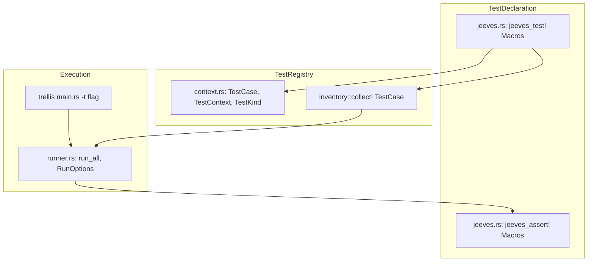

# Cove: Verification Framework & Test Harness

**Path:** `src/cove/`  
**Crate Member:** `trellis::cove`  
**Status:** Verification Foundation

---

## 1. Module Overview & Mission

`cove` is Trellis's integrated test harness and verification runtime. Rather than relying on separate integration test binaries or rigid test registries, `cove` utilizes compile-time inventory collection (`inventory` crate) alongside custom assertion macros (`jeeves`) to allow any subsystem module to declare tests and runnable examples directly alongside source code.

### Design Principles
- **Colocated Tests**: Unit tests and integration benchmarks reside directly within each subsystem (under `_tests.rs`), registering automatically into a central inventory.
- **Dual Verification Modes**: A test declared via `jeeves_test!` can be executed both via the standard Cargo test harness (`cargo test`) and via the custom Trellis CLI runner (`trellis -t <Filter>`).
- **Rich Contextual Assertions**: Assertions record failures into a `TestContext` structure rather than immediately terminating the process, enabling multi-assertion error reports.

---

## 2. Component Hierarchy & File Map



| File | Primary Types & Functions | Description |
|---|---|---|
| `context.rs` | `TestCase`, `TestContext`, `TestKind` | Core metadata definitions: test names, categories (Test vs Example), pass/fail counters. |
| `jeeves.rs` | `jeeves_test!`, `jeeves_assert!`, `jeeves_assert_eq!` | Procedural and declarative macros providing test registration and assertion collection. |
| `runner.rs` | `run_all`, `RunOptions` | Discovers registered tests, applies command-line filters, executes cases, and prints formatted summaries. |

---

## 3. Core Data Structures & Types

### 3.1 `TestCase` & `TestKind`
Every test registered in the application creates a static `TestCase` instance:
```rust
pub struct TestCase {
    pub name:   &'static str,
    pub kind:   TestKind,
    pub module: &'static str,
    pub func:   fn(&mut TestContext),
}

pub enum TestKind {
    Test,
    Example,
    Benchmark,
}
```

### 3.2 `TestContext`
Passed by mutable reference into every test:
```rust
pub struct TestContext {
    pub name:           &'static str,
    pub failures:       u32,
    pub failure_msgs:   Vec<String>,
}
```
Methods:
- `record_failure(msg)`: Increments error count and appends context without triggering a panic.
- `passed() -> bool`: Returns `failures == 0`.

---

## 4. Feature-by-Feature Deep Dive

### 4.1 Declarative Test Registration (`jeeves_test!`)
Defining a test is frictionless:
```rust
jeeves_test!(Heist, WorkStealing, |ctx| {
    let atelier = Atelier::Reset(4);
    jeeves_assert_eq!(ctx, atelier.WorkerCount(), 4);
});
```
This macro expands to two things simultaneously:
1. A static registration with `inventory::submit! { TestCase { ... } }`.
2. A standard `#[test]` function that invokes the test closure and panics if `ctx.failures > 0`, ensuring full compatibility with `cargo test`.

### 4.2 CLI Test Filtering & Runner
The Trellis CLI binary can run specific subsystems on demand:
- `trellis -t Silo`: Runs only tests registered under the `Silo` module.
- `trellis -t Karst`: Runs all Karst interconnect tests.
- `RunOptions`: Configures verbosity, stop-on-failure, and module filters.

---

## 5. Integration Boundaries

- **Upstream Dependencies**: `inventory`.
- **Downstream Consumers**: Every subsystem in Trellis (`silo`, `stalks`, `heist`, `flux`, `shard`, `fresco`, `fenst`, `fleck`, `flock`, `symph`, `drove`, `swarm`, `rube`, `karst`, `crew`, `zephyr`, `fascia`) imports `cove` to register their test suites.
