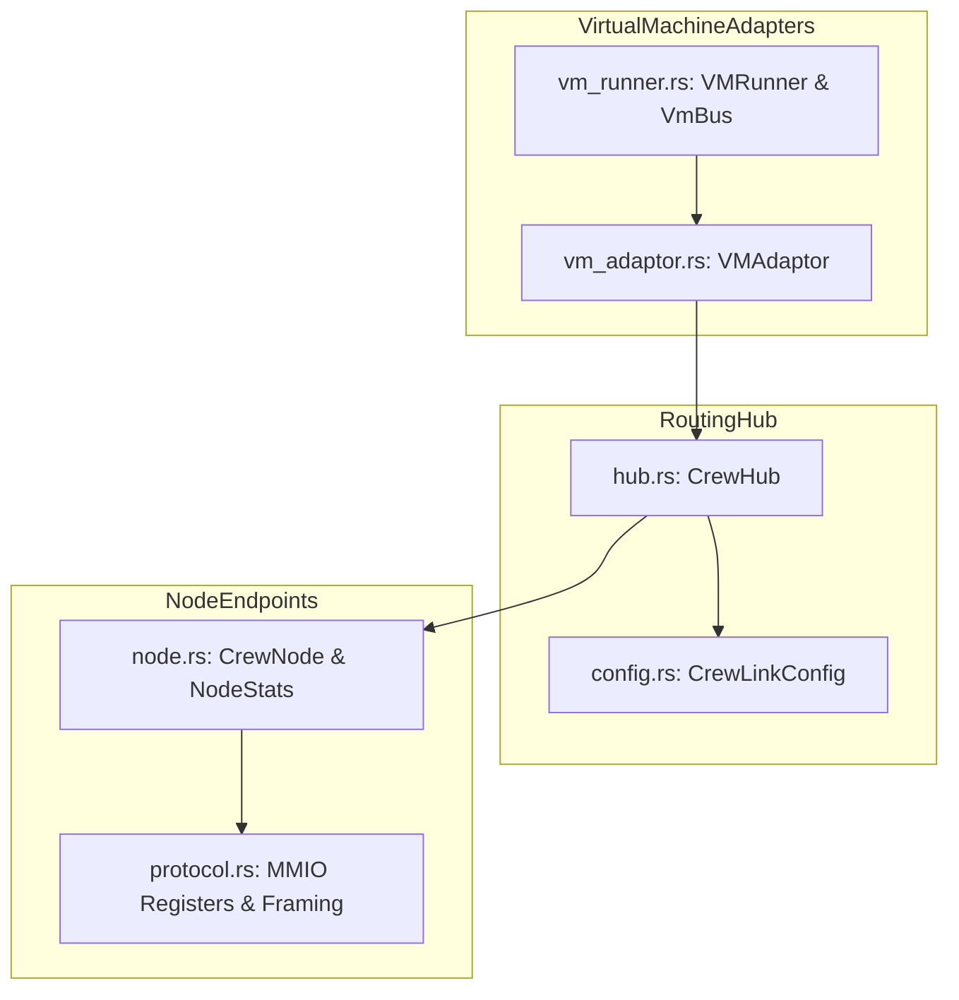

# Crew: Guest-Host Co-Simulation Protocol & MMIO Hub

**Path:** `src/crew/`  
**Crate Member:** `trellis::crew`  
**Status:** Co-Simulation & Hardware Emulation Interface

---

## 1. Module Overview & Mission

`crew` provides the hardware-in-the-loop co-simulation interface bridging external guest virtual machines (such as Renode emulating RISC-V processors) with the Trellis simulation environment. It implements memory-mapped I/O (MMIO) register windows, a multi-node message delivery hub (`CrewHub`), packet framing, and bidirectional synchronization across host threads and socket bridges.

### Design Principles
- **Standardized MMIO Window**: Exposes a clean 32-bit register map starting at base address `0x5000_0000`.
- **Decoupled Architecture (`CrewHub`)**: Nodes communicate via logical node IDs. The hub routes packets according to configurable link topologies (`CrewLinkConfig`).
- **Thread-Safe Cross-Process Bridging**: Accommodates external emulator bridges (TCP sockets via Python peripheral scripts) alongside in-process Rust runtime drivers.

---

## 2. Component Hierarchy & File Map



| File | Primary Types & Functions | Description |
|---|---|---|
| `hub.rs` | `CrewHub`, `MessageCallback` | Central message routing broker managing registered nodes, routing tables, and reset propagation. |
| `node.rs` | `CrewNode`, `NodeStats`, `RxPushOutcome` | Per-endpoint device state tracking ingress/egress queues, transfer counters, and drop statistics. |
| `protocol.rs` | `ProtocolMessage`, MMIO Register Constants | Register address offsets (`REG_STATUS`, `REG_TX_DATA`, etc.), status bits (`STATUS_TX_READY`), and packet framing. |
| `config.rs` | `CrewLinkConfig` | Network topology description defining permitted point-to-point and broadcast communication links. |
| `vm_adaptor.rs` | `VMAdaptor` | Bus adapter translating guest MMIO reads/writes into Crew hub transactions. |
| `vm_runner.rs` | `VMRunner`, `VmBus` | Execution lifecycle coordinator for virtualized buses. |

---

## 3. Core Data Structures & Types

### 3.1 MMIO Register Map (`protocol.rs`)
Base address: `0x5000_0000`:
| Offset | Name | R/W | Description |
|---|---|---|---|
| `0x00` | `REG_STATUS` | R | Bit 0: `STATUS_TX_READY`, Bit 1: `STATUS_RX_READY`, Bit 2: `STATUS_PEER_UP`. |
| `0x04` | `REG_NODE_ID` | R | Local Node ID assigned to this endpoint. |
| `0x08` | `REG_TX_DATA` | W | Writing a 32-bit word enqueues and transmits a packet. |
| `0x0C` | `REG_RX_DATA` | R | Reading pops the next 32-bit word from the ingress queue. |
| `0x10` | `REG_RX_COUNT` | R | Number of words currently pending in the ingress queue. |

### 3.2 `CrewHub`
Protected by internal synchronization:
```rust
pub struct CrewHub {
    _Nodes:     SpinMutex<Buff<CrewNode>>,
    _Config:    CrewLinkConfig,
    _Callbacks: SpinMutex<Vec<Box<dyn Fn(u32, ProtocolMessage) + Send + Sync>>>,
}
```

---

## 4. Feature-by-Feature Deep Dive

### 4.1 Hub Packet Forwarding (`RoutePacket`)
When a node writes to `REG_TX_DATA`:
1. The packet specifies destination node ID and 32-bit payload.
2. `CrewHub` verifies link authorization against `CrewLinkConfig`.
3. If valid, the packet is pushed to the target's receive FIFO.
4. Triggers any registered `MessageCallback` listeners (e.g. for logging or waveform tracing).

### 4.2 External Socket Bridging (`crew_pydev.py`)
For external Renode processes:
- Renode executes a Python peripheral script (`tools/renode/scripts/crew_pydev.py`).
- The script intercepts guest bus access at `0x5000_0000` and forwards transactions over a local TCP socket to Trellis's `RenodeRuntime`, which dispatches them into `CrewHub`.

---

## 5. Integration Boundaries

- **Upstream Dependencies**: `silo` (`Buff`, `Fifo`), `stalks` (`SpinMutex`).
- **Downstream Consumers**:
  - `zephyr`: Drives guest VM execution and connects virtual cores to the simulation hub.
