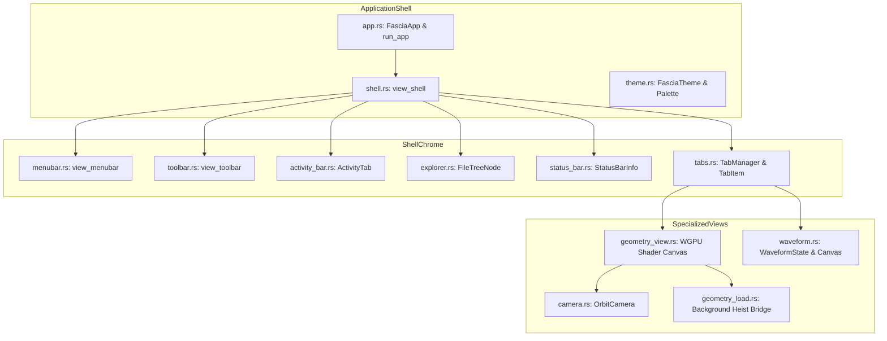

# Fascia: Native Desktop Shell & UI Workbench

**Path:** `src/fascia/`  
**Crate Member:** `trellis::fascia`  
**Status:** Presentation & Native Desktop Subsystem

---

## 1. Module Overview & Mission

`fascia` is Trellis's native desktop application shell and multi-document workbench. Built on top of `iced` (version 0.14) and `iced_aw`, it provides an IDE-style user experience: a left activity bar, collapsable filesystem/project explorer (`fenst`), top menu and toolbar, multi-document tab manager, and bottom status bar.

Internally, it hosts specialized rendering canvases:
1. **Interactive 3D Geometry Viewport (`geometry_view.rs`)**: An embedded `wgpu` shader canvas rendering meshes and point clouds with real-time orbit controls (`camera.rs`).
2. **Digital Waveform Viewer (`waveform.rs`)**: A vector-rendered timing diagram visualizer displaying 4-state logic signals parsed from VCD files (`rube`).

### Design Principles
- **Clean Elm Architecture**: Pure message-driven UI state machine (`AppMessage` $\rightarrow$ `update()` $\rightarrow$ `view()`).
- **Non-Blocking Background Ingestion**: Large assets (OBJ and PTS) are loaded asynchronously via a bounded 8-job queue into `heist` worker threads (`geometry_load.rs`), keeping the UI responsive.
- **Unified Theme Engine**: Comprehensive dark and light palettes (`WindowsDark`, `WindowsLight`, `Gruvbox`) styled to match native OS controls.

---

## 2. Component Hierarchy & File Map



| File | Primary Types & Functions | Description |
|---|---|---|
| `app.rs` | `FasciaApp`, `AppMessage`, `run_app` | Top-level Iced application root, event routing, and window initialization. |
| `shell.rs` | `view_shell` | Assembles the complete desktop layout: top menus, side drawer, tab bar, document canvas, status bar. |
| `theme.rs` | `FasciaTheme`, `ThemePalette`, `FasciaStyle` | Theme definitions (`WindowsDark`, `WindowsLight`, `Gruvbox`), colors, fonts, and widget styling rules. |
| `tabs.rs` | `TabManager`, `TabItem`, `TabKind`, `TabId` | Multi-document tab management (closing, switching, dirty indicators, tab kinds). |
| `explorer.rs` | `ExplorerState`, `FileTreeNode`, `view_explorer` | Interactive filesystem tree view integrated with `fenst`. |
| `menubar.rs` | `view_menubar`, `MenuAction` | Dropdown menus: File (Open, Save, Exit), View, Simulation, Help. |
| `toolbar.rs` | `view_toolbar`, `ToolBarAction` | Quick action buttons: Open File, Reload, Reset Camera, Run Simulation. |
| `activity_bar.rs`| `view_activity_bar`, `ActivityTab` | Leftmost icon bar toggling panels: Explorer, Geometry, Simulation, Settings. |
| `status_bar.rs` | `view_status_bar`, `StatusBarInfo` | Bottom footer showing active file, cursor position, worker counts, and status messages. |
| `geometry_view.rs`| `view_geometry_view` | Iced `shader::Program` adapter binding `wgpu` device/queue into `swarm::viewport`. |
| `camera.rs` | `OrbitCamera` | Spherical orbit camera calculations (azimuth, elevation, radius, pan, zoom). |
| `geometry_load.rs`| `GeometryLoadQueue` | Asynchronous pipeline queue transferring file bytes to background `heist` workers. |
| `waveform.rs` | `view_waveform`, `WaveformState` | Vector canvas visualizer rendering digital signal transitions across timestamps. |

---

## 3. Core Data Structures & Types

### 3.1 `TabKind` & Document Views
```rust
pub enum TabKind {
    Welcome,
    Text(String),
    Geometry(GeometryAsset),
    Waveform(VcdDisplayModel),
}
```

### 3.2 `OrbitCamera` (`camera.rs`)
```rust
pub struct OrbitCamera {
    pub target:    [f32; 3],
    pub distance:  f32,
    pub pitch:     f32,
    pub yaw:       f32,
    pub fov_y:     f32,
}
```
Converts spherical orbit coordinates into view and projection matrices via `glam::Mat4`, writing uniform updates directly into the GPU viewport.

---

## 4. Feature-by-Feature Deep Dive

### 4.1 Responsive Asynchronous Geometry Import (`geometry_load.rs`)
When a 100MB mesh or 500MB PTS point cloud is opened:
1. Fascia pushes a request to `GeometryLoadQueue` (bounded at 8 concurrent jobs).
2. The UI renders a loading spinner on the tab and remains responsive to mouse interaction.
3. A background task executes `fleck::ParsePts` or `fleck::ParseWaveObj` within `heist::Atelier`.
4. Upon completion, an `AppMessage::GeometryLoaded` event is dispatched to Iced, uploading vertices to `swarm::viewport` and displaying the mesh.

### 4.2 Interactive Digital Waveform Rendering (`waveform.rs`)
Renders timing diagrams from parsed VCD models:
- Left pane: Hierarchical signal tree with scope navigation.
- Right pane: Chronological signal transitions with color-coded logic levels:
  - High (`1`): Green stroke.
  - Low (`0`): Dim gray stroke.
  - Unknown (`X`): Red hatched fill.
  - High-Impedance (`Z`/`I`): Blue dashed stroke.
- Supports mouse-wheel horizontal panning and temporal zooming.

---

## 5. Integration Boundaries

- **Upstream Dependencies**: `iced`, `iced_aw`, `wgpu`, `glam`, `fenst`, `fleck`, `rube`, `heist`, `swarm`.
- **Downstream Consumers**: Top-level application entry point in `src/main.rs`.
