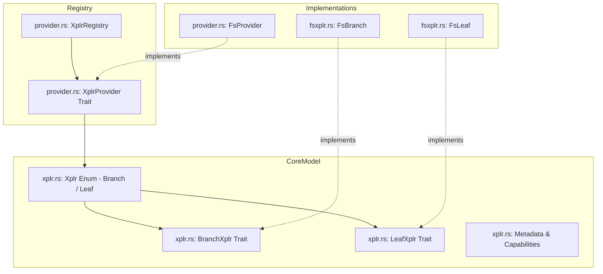

# Fenst: Explorer-Provider & Virtual Workspace Model

**Path:** `src/fenst/`  
**Crate Member:** `trellis::fenst`  
**Status:** Workspace & File Navigation Framework

---

## 1. Module Overview & Mission

`fenst` establishes a provider-neutral, virtualized directory and document explorer model. It cleanly decouples desktop GUI file navigation (in `fascia`) from the underlying physical storage medium. While its primary implementation is local filesystem access (`FsProvider`), the architecture permits virtual nodes, zip archive browsing, remote repositories, and in-memory test fixtures under an identical tree abstraction.

### Design Principles
- **Provider Neutrality**: Navigation widgets in `fascia` depend strictly on `XplrProvider`, `BranchXplr`, and `LeafXplr` traits, completely unaware of whether files reside on disk, in memory, or across a network.
- **Lazy Evaluation**: Folder contents are enumerated strictly on branch expansion.
- **Stream Slicing (`StreamChunk`)**: Supports chunked reading of large files without loading entire files into memory.

---

## 2. Component Hierarchy & File Map



| File | Primary Types & Functions | Description |
|---|---|---|
| `xplr.rs` | `Xplr`, `BranchXplr`, `LeafXplr`, `XplrNodeInfo`, `StreamChunk` | Core abstractions: directory branches, document leaves, node metadata, and data streaming. |
| `provider.rs` | `XplrProvider`, `XplrRegistry`, `FsProvider` | URI-to-root resolution, provider registration, and filesystem provider definition. |
| `fsxplr.rs` | `FsBranch`, `FsLeaf` | Standard OS filesystem implementation leveraging `std::fs` and metadata queries. |

---

## 3. Core Data Structures & Types

### 3.1 `Xplr` Hierarchy
```rust
pub enum Xplr {
    Branch(Box<dyn BranchXplr>),
    Leaf(Box<dyn LeafXplr>),
}
```

### 3.2 `BranchXplr` & `LeafXplr`
- **`BranchXplr`**: Represents folders/containers:
  ```rust
  pub trait BranchXplr: Send + Sync {
      fn Name(&self) -> &str;
      fn Path(&self) -> &str;
      fn Children(&self) -> Result<Vec<Xplr>, String>;
      fn Refresh(&mut self) -> Result<(), String>;
  }
  ```
- **`LeafXplr`**: Represents files/documents:
  ```rust
  pub trait LeafXplr: Send + Sync {
      fn Name(&self) -> &str;
      fn Path(&self) -> &str;
      fn Size(&self) -> u64;
      fn ReadChunk(&self, offset: u64, len: u32) -> Result<StreamChunk, String>;
  }
  ```

---

## 4. Feature-by-Feature Deep Dive

### 4.1 URI Scheme Resolution (`XplrRegistry`)
The explorer registry maps schemes (e.g. `file://`, `virtual://`, `tar://`) to provider instances. When the user opens a workspace folder in Fascia, the registry looks up the appropriate provider and returns the root `BranchXplr`.

### 4.2 Safe Sliced Streaming (`StreamChunk`)
`LeafXplr::ReadChunk` returns bounded `StreamChunk` buffers:
- Allows the UI to preview the first 64KB of massive 2GB point cloud files without blocking the interface or blowing out memory limits.

---

## 5. Integration Boundaries

- **Upstream Dependencies**: Standard library filesystem and path APIs.
- **Downstream Consumers**:
  - `fascia`: Drives the left-hand workspace tree view, file opening dialogs, and geometry document loading.
