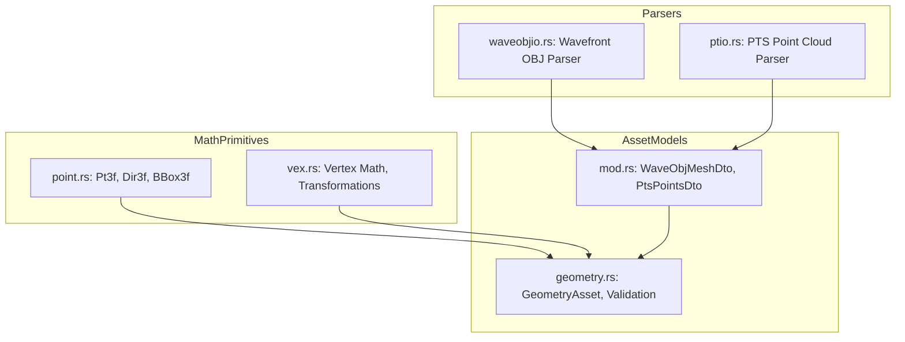

# Fleck: 3D Geometry Ingestion & Asset Models

**Path:** `src/fleck/`  
**Crate Member:** `trellis::fleck`  
**Status:** Geometry Processing & Ingestion Framework

---

## 1. Module Overview & Mission

`fleck` is Trellis's 3D geometric asset representation and ingestion engine. It parses, validates, and prepares 3D polygon meshes (Wavefront OBJ) and dense LiDAR / laser point clouds (PTS format), transforming raw text streams into compact, GPU-ready contiguous vertex buffers (`GeometryAsset`).

### Design Principles
- **Contiguous Buffer Optimization**: Polygon vertex indices, coordinates, and computed surface normals are packed into flat `silo::Buff` arrays.
- **Normalization & Centering**: Automatic computation of axis-aligned bounding boxes (AABB) with unit-box centering to simplify viewport camera control.
- **Robust Triangulation**: Polygon faces with $N > 3$ vertices are triangulated using fan triangulation.
- **Decoupled Graphics**: `fleck` has zero dependency on `wgpu` or graphics hardware; it produces pure geometry DTOs ready for ingestion by `swarm::viewport`.

---

## 2. Component Hierarchy & File Map



| File | Primary Types & Functions | Description |
|---|---|---|
| `point.rs` | `Pt3f`, `Dir3f`, `BBox3f`, `WPt3f` | 3D coordinate vectors, direction vectors, and axis-aligned bounding box calculations. |
| `vex.rs` | `Vex3f`, vertex transformation traits | Vertex operations, cross products, dot products, and normal vector math. |
| `waveobjio.rs` | `WaveObjModel`, `Face`, `ParseWaveObj` | Shard-powered parser for Wavefront `.obj` files (vertices, normals, faces). |
| `ptio.rs` | `PtsCloud`, `PtsPoint`, `ParsePts` | High-speed parser for ASCII `.pts` LiDAR point clouds. |
| `geometry.rs` | `GeometryAsset`, `GeometryAssetKind` | Validated, GPU-renderable asset struct with vertex positions, normals, and indices. |
| `mod.rs` | `WaveObjMeshDto`, `PtsPointsDto` | Data Transfer Objects bridging file parsers to asset compilers. |

---

## 3. Core Data Structures & Types

### 3.1 `GeometryAsset`
The unified representation consumed by the rendering viewport:
```rust
pub struct GeometryAsset {
    pub _Kind:          GeometryAssetKind,
    pub _Points:        Buff<[f32; 3]>,
    pub _Normals:       Buff<[f32; 3]>,
    pub _Indices:       Buff<u32>,
    pub _Bbox:          BBox3f,
    pub _VertexCount:   usize,
    pub _PrimitiveCount: usize,
}

pub enum GeometryAssetKind {
    Mesh,
    PointCloud,
}
```

### 3.2 Bounding Box (`BBox3f`)
Tracks physical extents:
- `_Min: [f32; 3]`, `_Max: [f32; 3]`.
- `Center() -> [f32; 3]`, `Diagonal() -> f32`, `Extents() -> [f32; 3]`.
- Used by `fascia` to position orbit cameras automatically.

---

## 4. Feature-by-Feature Deep Dive

### 4.1 Wavefront OBJ Import Pipeline (`waveobjio.rs`)
1. **Lexing/Parsing**: Uses `shard` combinators to parse `v`, `vn`, and `f` statements.
2. **Indexing Normalization**: Supports 1-based and negative relative indices standard in OBJ.
3. **Polygon Tessellation**: Polygons with 4 or more vertices are decomposed into triangle fans ($v_0, v_i, v_{i+1}$).
4. **Normal Generation**: If vertex normals (`vn`) are omitted, `fleck` computes face normals via vector cross-products:
   $$\vec{N} = (\vec{P}_1 - \vec{P}_0) \times (\vec{P}_2 - \vec{P}_0)$$

### 4.2 High-Throughput Point Cloud Ingestion (`ptio.rs`)
PTS files often contain tens of millions of scan coordinates. `ptio.rs` uses fast arithmetic scanners to load $(X, Y, Z, \text{intensity})$ quadruplets directly into `Buff<[f32; 3]>` at gigabyte-per-second streaming speeds.

---

## 5. Integration Boundaries

- **Upstream Dependencies**: `silo` (`Buff`, `Stash`), `flux`, `shard`.
- **Downstream Consumers**:
  - `fascia`: Background geometry loading (`geometry_load.rs`).
  - `swarm::viewport`: Uploads `GeometryAsset` vertex and index buffers to GPU VRAM for real-time rendering.
