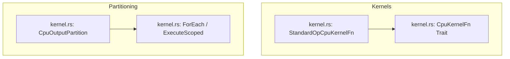

# Flock: CPU Kernel Implementations & Data Partitioning

**Path:** `src/flock/`  
**Crate Member:** `trellis::flock`  
**Status:** Compute & Kernel Framework

---

## 1. Module Overview & Mission

`flock` contains host CPU implementations of standard SIMD compute kernels used by Trellis whenever hardware GPU compute dispatch is unavailable or when operating in CPU-only test environments. It defines structured output partitioning (`CpuOutputPartition`) to enable cache-local, data-parallel execution across Heist worker threads.

### Design Principles
- **Bit-Exact Parity with GPU Shaders**: All operations (`Double`, `Collatz`, `VectorAdd`, `PointCloud`, `CameraTransform`) follow mathematical rules identical to their SPIR-V and WGSL shader counterparts.
- **Cache-Aware Partitioning**: Dispatches divide linear buffers into disjoint slices, preventing false sharing across CPU cores.
- **Zero-Allocation Execution**: Kernels operate in-place or transfer directly between pre-allocated `silo` arrays.

---

## 2. Component Hierarchy & File Map



| File | Primary Types & Functions | Description |
|---|---|---|
| `kernel.rs` | `CpuKernelFn`, `CpuOutputPartition`, `StandardOpCpuKernelFn` | CPU kernel signatures, output partitioning slices, and standard operation kernel mappings. |

---

## 3. Core Data Structures & Types

### 3.1 `CpuOutputPartition<'a, T>`
Encapsulates a disjoint, mutable slice of an output buffer assigned to a single thread:
```rust
pub struct CpuOutputPartition<'a, T> {
    pub _BaseIndex: u32,
    pub _Data:      MutArr<'a, T>,
}
```
Methods:
- `ForEach(closure)`: Iterates over the partition with global index offset calculation.
- `ExecuteScoped(atelier, closure)`: Splits the partition across all workers in an `Atelier` and joins upon completion.

### 3.2 Standard Kernel Operations
1. **`Double`**: Multiplies single-precision floats ($y_i = 2 \cdot x_i$).
2. **`Collatz`**: Computes the Collatz stopping time for unsigned 32-bit integers.
3. **`VectorAdd`**: Computes linear element-wise vector sums ($z_i = x_i + y_i$).
4. **`PointCloud`**: Procedural point generation and jittering.
5. **`CameraTransform`**: 3D perspective projection and depth attenuation.

---

## 4. Integration Boundaries

- **Upstream Dependencies**: `silo` (`MutArr`), `heist` (`Atelier`).
- **Downstream Consumers**:
  - `swarm::cpu`: Executes `flock` kernels inside `ComputeDevice::Dispatch` and `DispatchScoped`.
  - `karst::vpu`: Uses `DoubleKernel` for simulated near-memory vector operations.
