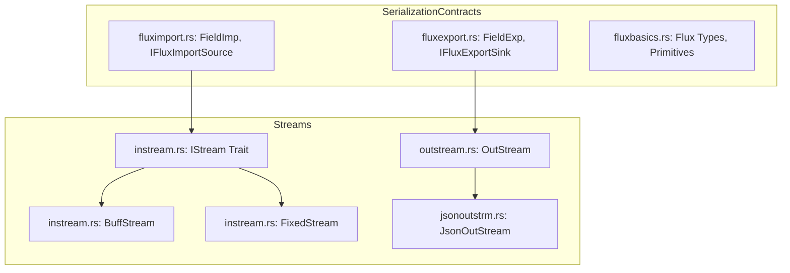

# Flux: Streaming, Serialization & Data Descriptors

**Path:** `src/flux/`  
**Crate Member:** `trellis::flux`  
**Status:** Data & Serialization Framework

---

## 1. Module Overview & Mission

`flux` is Trellis's native serialization and binary/text streaming subsystem. Instead of adopting external, heavyweight frameworks like `serde`, Trellis implements `flux` to provide zero-copy, field-oriented import and export pipelines that map domain objects directly to and from contiguous byte streams.

### Design Principles
- **No Third-Party Serde Dependency**: All serialization logic compiles without heavy proc-macro expansion or dynamic reflection.
- **Unified Stream Interfaces**: Input streams (`IStream`) abstract both fixed-capacity memory slices and growable buffers.
- **Explicit Field Sinks & Sources**: Objects implement `IFluxExportSource` or `IFluxImportSink` by declaring individual field descriptors (`FieldExp`, `FieldImp`).
- **Structured JSON Emission**: `JsonOutStream` writes valid JSON directly with correct indentation, array delimiters, and key escaping.

---

## 2. Component Hierarchy & File Map



| File | Primary Types & Functions | Description |
|---|---|---|
| `instream.rs` | `IStream`, `BuffStream`, `FixedStream` | Abstract input stream trait, backing memory slices, and lookahead cursors. |
| `outstream.rs` | `OutStream` | High-performance binary and ASCII byte sink built over `Stash<u8>`. |
| `jsonoutstrm.rs` | `JsonOutStream` | Structured JSON writer formatting keys, values, objects, and arrays. |
| `fluxexport.rs` | `FieldExp`, `IFluxExportSink`, `IFluxExportSource` | Field serialization descriptor framework for emitting domain objects. |
| `fluximport.rs` | `FieldImp`, `IFluxImportSink`, `IFluxImportSource`, `FluxError` | Deserialization sink descriptors for reconstructing domain objects from streams. |
| `fluxbasics.rs` | Shared basic types, formatting utilities | Data primitives and integer-to-string formatters. |

---

## 3. Core Data Structures & Types

### 3.1 Input Streams (`IStream`)
```rust
pub trait IStream {
    fn ReadByte(&mut self) -> Option<u8>;
    fn PeekByte(&self) -> Option<u8>;
    fn Pos(&self) -> u32;
    fn Seek(&mut self, pos: u32);
    fn Len(&self) -> u32;
    fn Remaining(&self) -> u32;
}
```
- `FixedStream<'a>`: Borrows an immutable slice `&'a [u8]` without allocation.
- `BuffStream`: Owns a `Buff<u8>` or `Stash<u8>` buffer.

### 3.2 Field Descriptors (`FieldExp` & `FieldImp`)
Provides declarative schemas for domain objects without procedural macros:
```rust
pub struct FieldExp<'a> {
    pub _Name:  &'static str,
    pub _Type:  FieldType,
    pub _Data:  FieldData<'a>,
}
```
Supported types include primitives (`U8`, `U16`, `U32`, `U64`, `I32`, `F32`, `F64`), strings, raw buffers, and nested objects.

---

## 4. Feature-by-Feature Deep Dive

### 4.1 Zero-Allocation Stream Parsing
`IStream` integrates directly with the `shard` parsing engine. `FixedStream` allows `shard` to parse multi-megabyte OBJ and VCD files directly out of memory-mapped or pre-loaded files without heap allocations during character matching.

### 4.2 Formatted JSON Generation (`JsonOutStream`)
`JsonOutStream` tracks nesting depth and manages commas, braces, and brackets automatically:
```rust
let mut json = JsonOutStream::New();
json.BeginObject();
json.WriteKeyVal("name", "Die0");
json.WriteKeyVal("cycles", 1024u64);
json.EndObject();
```

---

## 5. Integration Boundaries

- **Upstream Dependencies**: `silo` (`Buff`, `Stash`, `Arr`).
- **Downstream Consumers**:
  - `shard`: Consumes `IStream` for all grammar matching.
  - `fresco`: Serializes mathematical expressions.
  - `rube`: Emits VCD timing files and circuit telemetry.
  - `fleck`: Streams geometry coordinate vertices.
