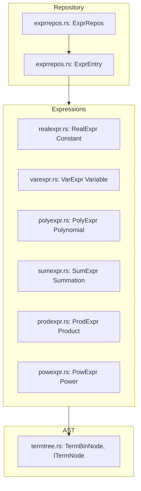

# Fresco: Symbolic Expression Modeling & Term Trees

**Path:** `src/fresco/`  
**Crate Member:** `trellis::fresco`  
**Status:** Mathematical & Symbolic Expression Framework

---

## 1. Module Overview & Mission

`fresco` provides symbolic expression modeling, algebraic term trees, and variable repositories in Trellis. Designed for analytical model evaluation and parametric optimization in physical/circuit systems, it provides structured polynomial, summation, product, and exponentiation expressions that can be evaluated, simplified, and transformed into binary term trees.

### Design Principles
- **Repository-Backed Entities**: Expressions and variables are registered in an `ExprRepos` table, ensuring consistent symbol interning and attribute tagging.
- **Algebraic Hierarchy**: Clean distinction between terminal values (`RealExpr`, `VarExpr`) and composite operations (`PolyExpr`, `SumExpr`, `ProdExpr`, `PowExpr`).
- **Binary AST Integration**: Seamless projection of mathematical expressions into binary `TermTree` structures using `stalks::Node`.

---

## 2. Component Hierarchy & File Map



| File | Primary Types & Functions | Description |
|---|---|---|
| `exprrepos.rs` | `ExprRepos`, `ExprEntry`, `BaseExpr` | Central storage repository for expressions, managing unique IDs, scopes, and variable attributes. |
| `varexpr.rs` | `VarExpr`, `VarAttrib`, `VarKind` | Named symbolic variable representation (continuous, discrete, integer). |
| `realexpr.rs` | `RealExpr` | Constant floating-point numerical leaf expression. |
| `polyexpr.rs` | `PolyExpr` | Polynomial term $c \cdot x^k$ with coefficient and exponent. |
| `sumexpr.rs` | `SumExpr` | N-ary summation of child expressions ($\sum_i E_i$). |
| `prodexpr.rs` | `ProdExpr` | N-ary multiplication of child expressions ($\prod_i E_i$). |
| `powexpr.rs` | `PowExpr` | General exponentiation ($u^v$). |
| `termtree.rs` | `TermBinNode`, `ITermNode`, `Term` | Maps expressions into binary term trees for recursive evaluation and rewriting. |

---

## 3. Core Data Structures & Types

### 3.1 `ExprRepos`
Manages an array of expression entries using `Silo` buffers:
```rust
pub struct ExprRepos {
    pub _Entries:   Stash<ExprEntry>,
    pub _Variables: Stash<VarAttrib>,
}
```
Provides:
- `VarCreate(name, is_discrete) -> u32`: Registers or retrieves a variable index.
- `RealCreate(value) -> u32`: Registers a constant literal.
- `SumCreate(operands) -> u32`: Assembles a summation node.

### 3.2 `TermTree` & `TermBinNode`
Represents an algebraic expression as a binary operation node:
```rust
pub struct TermBinNode {
    pub _Left:  Option<Box<TermBinNode>>,
    pub _Right: Option<Box<TermBinNode>>,
    pub _Op:    TermOp,
}
```

---

## 4. Feature-by-Feature Deep Dive

### 4.1 Evaluation & Substitution
Expressions evaluate against a state dictionary or array of variable values:
- `Eval(context: &[f64]) -> f64`: Recursively calculates the numerical value.
- Polynomial fast paths evaluate terms using Horner's method for numerical stability.

### 4.2 Serialization via Flux
Every expression type implements `flux::IFluxExportSource` and `IFluxImportSink`, enabling symbolic formulas to be saved and loaded directly from disk or network streams.

---

## 5. Integration Boundaries

- **Upstream Dependencies**: `silo` (`Stash`, `Buff`), `stalks` (`Node`), `flux` (`FieldExp`).
- **Downstream Consumers**: Used in physical parameter modeling and analytical calculations across Trellis.
