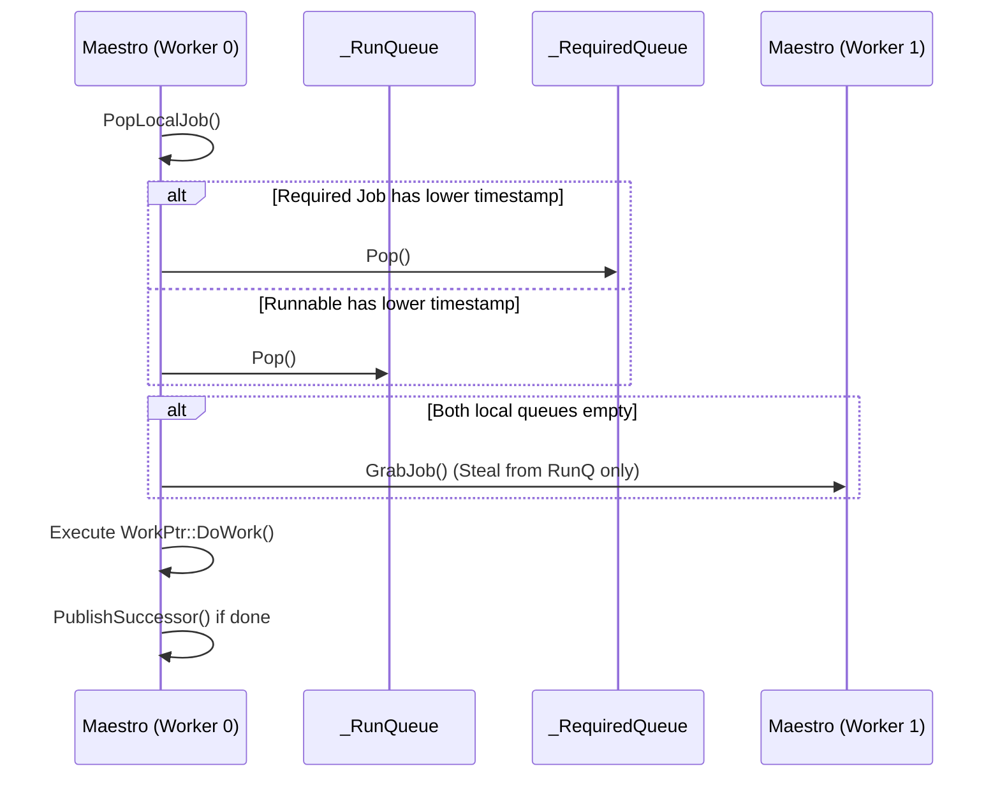

# Heist: Work-Stealing Task Scheduler & Chore DAG Engine

**Path:** `src/heist/`  
**Crate Member:** `trellis::heist`  
**Status:** Core Execution Subsystem

---

## 1. Module Overview & Mission

`heist` is Trellis's high-performance task scheduling and Directed Acyclic Graph (DAG) execution engine. Modeled after C++ Trellis `heist/atelier.h` and modern work-stealing schedulers (such as Cilk and Work-Stealing Run-Time), it orchestrates multi-threaded worker pools (`Atelier`), manages per-thread task queues (`Maestro`), balances work via randomized work stealing, and coordinates complex dependency graphs (`ChoreNode`) composed of sequential, parallel, data-parallel (`SpawnQuell`), and coroutine (`CoroChore`) jobs.

### Design Principles
- **Randomized Work Stealing**: Idle worker threads steal runnables from victim queues using split-mix pseudo-random generation, minimizing queue contention.
- **Affinity & Non-Stealable Continuations**: Jobs can be strictly pinned to dedicated workers (`ChorePlacement::Require(w)`), placed into worker-local non-stealable queues (`_RequiredQueue`), and resumed strictly on their pinned cores.
- **Monotone Enqueue Timestamping**: Timestamp-based priority ordering ensures runnables and required continuations preserve deterministic dispatch ordering without race hazards.
- **Zero-Copy Pass-by-Value AST**: Chore trees are structured as value types moved directly into execution graphs, eliminating atomic reference counts (`Arc`) and clone overhead.
- **Cooperative Coroutine Support**: Integrates `stalks::coro` into DAG pipelines, allowing long-running tasks to yield and resume without blocking OS worker threads.

---

## 2. Component Hierarchy & File Map

```mermaid
flowchart TD
    subgraph Engine
        Atelier[atelier.rs: Atelier & AtelierState]
        Maestro[maestro.rs: Maestro Worker Context]
        Info[atelierinfo.rs: AtelierInfo & JobInfo]
    end
    subgraph SchedulingQueues
        RunQ[maestro.rs: _RunQueue Stealable]
        ReqQ[maestro.rs: _RequiredQueue Pinned Non-Stealable]
        TempQ[maestro.rs: _TempQueue Thread Local]
        Cache[maestro.rs: _JobCache Slot Recycler]
    end
    subgraph ChoreDAG
        Chore[choretree.rs: Chore Leaf]
        ChoreNode[choretree.rs: ChoreNode AST - Seq >>, Par |]
        CoroChore[corochore.rs: CoroChore & ErasedCoro]
        SpawnQuell[choretree.rs: SpawnQuell Data Parallelism]
        Placement[placement.rs: ChorePlacement Any, Prefer, Require]
    end

    Atelier --> Maestro
    Maestro --> RunQ
    Maestro --> ReqQ
    Maestro --> TempQ
    Maestro --> Cache
    ChoreNode --> Chore
    ChoreNode --> CoroChore
    ChoreNode --> SpawnQuell
    Chore --> Placement
    CoroChore --> Placement
```

| File | Primary Types & Functions | Description |
|---|---|---|
| `atelier.rs` | `Atelier`, `AtelierState`, `ExecuteLoop` | Central scheduler coordinator, worker thread lifecycle management, job slot allocation tables, and execution loops. |
| `maestro.rs` | `Maestro`, `MaestroContext` | Per-worker execution context owning local stealable and non-stealable scheduling queues, steal metrics, and thread affinity. |
| `placement.rs` | `ChorePlacement`, `PlacementKind` | Affinity specifications: `Any`, `Prefer(worker)`, and `Require(worker)`. |
| `choretree.rs` | `Chore`, `ChoreNode`, `PostChoreNode`, `SpawnQuellNode` | Algebraic chore tree DSL (`>>` for then, `\|` for par), type-erased closure execution, and tree decomposition. |
| `corochore.rs` | `CoroChore`, `CoroSharedFn`, `coro_job_func` | Stackful coroutine chore wrapper supporting cooperative suspension, worker pinning, and DAG successor signaling. |
| `atelierinfo.rs` | `AtelierInfo`, `JobInfo` | Introspection structures exposing worker thread counts, active jobs, and execution diagnostics. |

---

## 3. Core Data Structures & Types

### 3.1 `Atelier` & `AtelierState`
`Atelier` wraps a shared `Arc<AtelierState>`:
- `_SzThreads`: Total active worker threads ($W$).
- `_JobBuff`: Slot storage storing up to 65,536 active jobs (`SpinMutex<Option<WorkPtr>>`).
- `_JobPlacements`: Array of packed `u16` tracking thread affinity per job slot.
- `_JobSeq`: Atomically monotonically increasing enqueue timestamps (`AtomicU64`).
- `_SzPreds`: Atomic predecessor count arrays for DAG dependency resolution.
- `_SuccIds`: Downstream successor job IDs.
- `_Maestros`: Array of per-worker `Maestro` execution contexts.

### 3.2 `Maestro` Worker Queues
Each worker maintains four distinct FIFO queues (`silo::Stash<u16>` guarded by `SpinMutex`):
1. **`_RunQueue`**: Stealable FIFO queue containing ordinary (`Any` or `Prefer`) jobs.
2. **`_RequiredQueue`**: Non-stealable FIFO queue containing jobs pinned strictly to this worker (`Require(w)`). Victims will never steal from this queue.
3. **`_TempQueue`**: Private local queue buffering newly spawned jobs during task execution before flushing into global scheduling.
4. **`_JobCache`**: Recycled job slot cache to avoid contention on the global free-job stash.

### 3.3 `ChorePlacement`
```rust
#[derive(Clone, Copy, PartialEq, Eq)]
pub enum ChorePlacement {
    Any,
    Prefer(u32),
    Require(u32),
}
```
- `Any`: Can run on any worker thread; eligible for work stealing.
- `Prefer(w)`: Placed in Worker $w$'s `_RunQueue`, but eligible for stealing if other workers run out of work.
- `Require(w)`: Placed strictly in Worker $w$'s `_RequiredQueue`. **Thieves can never steal it.**

### 3.4 Chore DAG Representation (`ChoreNode`)
Series-parallel DAGs are formed using algebraic operator syntax:
```rust
pub enum ChoreNode {
    Leaf(Chore),
    Seq(Box<ChoreNode>, Box<ChoreNode>),
    Par(Box<ChoreNode>, Box<ChoreNode>),
    SpawnQuell(ErasedSpawnQuell),
    Coro(ErasedCoro),
}
```

---

## 4. Feature-by-Feature Deep Dive

### 4.1 Monotone Enqueue Timestamps & Parity Scheduling
To prevent required continuations from starving general runnables (or vice-versa), `AtelierState::StampJobSeq(job_id)` stamps each job with a monotonically increasing integer (`_JobSeqTicket`).

In `Maestro::PopLocalJob`:
1. Inspects the head of `_RunQueue` and `_RequiredQueue`.
2. Compares timestamps: the job with the lower sequence number (earliest enqueue time) executes first.
3. If runnables remain in the system (`_SzSchedRunnables > 0`), required jobs yield precedence to ensure runnable starvation does not occur.

### 4.2 Randomized Work Stealing (`GrabJob`)
When a worker's local queues are empty:
1. Generates a random victim index: $v = \text{rand}() \pmod W$.
2. Locks the victim's `_RunQueue` and pops from the back (`PopStealJob`).
3. If stolen, records a steal attempt and success in `_SzStealAttempts` and `_SzStealSuccesses`.
4. **Guaranteed Safety**: Victims' `_RequiredQueue` is never touched by stealing threads.

### 4.3 Coroutine Chore Continuations (`CoroChore`)
`CoroChore` wraps a stackful coroutine into a standard DAG node:
1. When scheduled, the worker calls `coro.Resume(worker_ptr)`.
2. If the coroutine yields (`CoroRes::Yield`), `coro_job_func` posts a continuation job with its original placement (`Require(w)`) and original successor ID preserved.
3. If the coroutine finishes (`CoroRes::Done`), it atomically decrements the successor's predecessor count (`PublishSuccessor(succ_id)`), unlocking downstream DAG nodes.

### 4.4 Data-Parallelism via `SpawnQuell`
Data-parallel map-reduce patterns are expressed via `SpawnQuell(data, target, spawn_fn, quell_fn)`:
- Chunks input slices dynamically across worker thread counts ($2 \times W$).
- Posts child worker jobs that converge on a single `quell_job` completion barrier.

---

## 5. Execution Model & Concurrency



---

## 6. Integration Boundaries

- **Upstream Dependencies**: `silo` (`Buff`, `Stash`), `stalks` (`Spinlock`, `IWorker`, `WorkPtr`, `Coro`).
- **Downstream Consumers**:
  - `karst`: Pins parallel die steps (`Die0.Require(0) | Die1.Require(1)`), coordinates fabric batching, and orders VPU channels.
  - `rube`: Dispatches parallel circuit evaluation warps.
  - `swarm`: Powers CPU compute kernels and geometry data loading.
