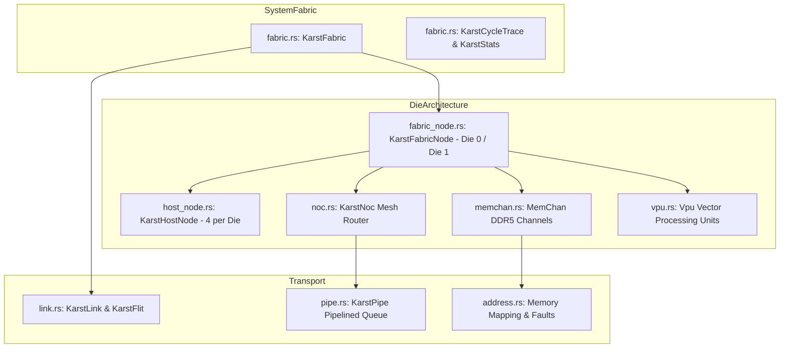

# Karst: Interconnect, NoC & Memory Fabric Simulation

**Path:** `src/karst/`  
**Crate Member:** `trellis::karst`  
**Status:** Multi-Die Simulation Subsystem

---

## 1. Module Overview & Mission

`karst` models a high-throughput, multi-die system-on-chip (SoC) memory and interconnect fabric. It simulates host processor nodes, on-chip Network-on-Chip (NoC) routers, inter-die high-speed links, DDR5 memory channels (`MemChan`), and near-memory Vector Processing Units (`Vpu`).

The module achieves deterministic, bit-exact cycle parity between serial and parallel execution across variable worker counts by integrating tightly with `heist`'s affinity-aware chore DAG scheduler.

### Design Principles
- **Detailed Physical Topology**: Models 2 identical Dies, 8 Host Nodes (4 per die), a 2D mesh NoC, 16 DDR5 memory channels, and 16 VPUs.
- **Credit-Based & Lossless Handshake Transport**: Flits traverse pipelined queues with backpressure and queue saturation tracking.
- **Multi-Worker Deterministic Parallelism**:
  - **Parallel Die Stepping**: Concurrent stepping of Die 0 on Worker 0 and Die 1 on Worker 1 (`Die0.Require(0) | Die1.Require(1)`).
  - **Affinity Fabric Batching**: Independent fabric instances mapped deterministically to workers ($i \pmod W$).
  - **Pinned Coroutine Continuations**: Epoch-based fabric advancement (`AdvanceIndependentCoro`) suspending and resuming strictly on designated cores.
  - **Dependency-Ordered VPU Dispatch**: Same-channel VPU operations serialize sequentially (`>>`), while disjoint channels execute concurrently (`|`).

---

## 2. Component Hierarchy & File Map



| File | Primary Types & Functions | Description |
|---|---|---|
| `fabric.rs` | `KarstFabric`, `KarstStats`, `KarstCycleTrace` | Top-level fabric coordinator, cycle advancement, stats tracking, parallel stepping, and VPU batching. |
| `fabric_node.rs` | `KarstFabricNode` | Per-die container managing 4 host nodes, 8 memory channels, NoC routers, and inter-die link ports. |
| `host_node.rs` | `KarstHostNode`, `HostTransaction`, `HostResponse` | Host processing core issuing memory read/write requests and tracking latencies. |
| `noc.rs` | `KarstNoc`, `KarstNocQueueDepths` | Network-on-Chip router managing crossbar routing, ingress/egress queues, and backpressure. |
| `memchan.rs` | `MemChan`, `MemChanStats` | DDR5 memory channel backed by `swarm::ComputeBuffer` with burst read/write handling. |
| `vpu.rs` | `Vpu` | Vector / Near-Memory Processing Unit executing Swarm compute kernels on memory channels. |
| `link.rs` | `KarstFlit`, `KarstLink` | Inter-die flit representation and credit-based physical link model. |
| `pipe.rs` | `KarstPipe` | Multi-stage transport pipeline modeling propagation delay and backpressure. |
| `address.rs` | `DecodeLocalWord`, `MemoryFault` | Physical address decoding, channel striping, and fault injection verification. |
| `config.rs` | Constants | Topology sizing: `K_NUM_DIES = 2`, `K_HOSTS_PER_FABRIC = 8`, `K_MEM_CHANS_PER_FABRIC = 16`. |

---

## 3. Core Data Structures & Types

### 3.1 `KarstFlit` (Link Transfer Unit)
64-bit word payload with routing and command metadata:
```rust
pub struct KarstFlit {
    pub _Data:      u64,
    pub _Dest:      u8,
    pub _Src:       u8,
    pub _Op:        FlitOp,
    pub _IsTail:    bool,
}
```

### 3.2 `KarstCycleTrace`
Captures cycle-by-cycle signal waveforms:
```rust
pub struct KarstCycleTrace {
    pub _Cycle:        u64,
    pub _IngressValid: [SignalMask; 2],
    pub _IngressReady: [SignalMask; 2],
    pub _IngressData:  [[u64; 10]; 2],
    pub _EgressValid:  [SignalMask; 2],
    pub _EgressReady:  [SignalMask; 2],
    pub _EgressData:   [[u64; 10]; 2],
    pub _HostTxCount:  u64,
    pub _HostRxCount:  u64,
}
```

---

## 4. Feature-by-Feature Deep Dive

### 4.1 Two-Die Parallel Cycle Stepping
When `workers >= 2`, `step_cycle` splits die execution across cores:
```rust
let (d0, d1) = self.prepare_cycle_inputs();
self.record_link_stats(&d0, &d1);

let c0 = Chore::FromClosure("Die0", move |_w| {
    f0.step(&d0.valid, &d0.data, &d0.ready);
}).Require(0);

let c1 = Chore::FromClosure("Die1", move |_w| {
    f1.step(&d1.valid, &d1.data, &d1.ready);
}).Require(1);

let tree = c0 | c1;
atelier.MainMaestro().PostChoreTree(tree);
atelier.DoLaunch();
```
- **Zero-Copy Ingestion**: Input signals are borrowed via raw pointers, completely avoiding buffer cloning.
- **Deterministic Parity**: Produces traces identical bit-for-bit with single-threaded execution.

### 4.2 Independent Fabric Batching with Affinity (`AdvanceIndependent`)
For simulation farms running multiple independent fabrics:
- Fabrics are pinned to workers using $w = i \pmod W$.
- All fabrics advance concurrently without inter-fabric lock contention.

### 4.3 Pinned Coroutine Epoch Progression (`AdvanceIndependentCoro`)
For long-running batches with checkpointing:
- Each fabric runs inside a `CoroChore` pinned to a specific worker.
- Steps in chunks of `chunk_ticks`, calls `yielder.Suspend(())`, and resumes strictly on the same worker via Heist's affinity continuation engine.

### 4.4 Dependency-Preserving VPU Batch Dispatch (`dispatch_vpu_batch`)
Groups vector operations by target memory channel:
- Operations on the same channel are chained sequentially: `disp_0 >> disp_1`.
- Operations on different channels are chained in parallel: `chan_0 | chan_1`.
- Channels are routed to worker cores: `Require((chan_idx / 4) % workers)`.

---

## 5. Integration Boundaries

- **Upstream Dependencies**: `silo` (`Buff`, `Stash`, `Arr`), `stalks` (`Coro`), `heist` (`Atelier`, `Chore`, `CoroChore`), `swarm` (`ComputeBuffer`, `ComputeDevice`).
- **Downstream Consumers**: Used for SoC hardware architectural exploration, memory subsystem benchmarking, and hardware co-simulation.
