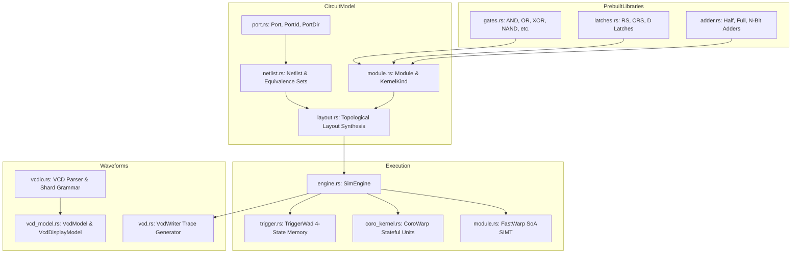

# Rube: Digital Circuit Simulation & Waveform Processing

**Path:** `src/rube/`  
**Crate Member:** `trellis::rube`  
**Status:** Digital Simulation Subsystem

---

## 1. Module Overview & Mission

`rube` is Trellis's digital logic circuit design, compilation, simulation, and waveform visualization framework. It combines gate-level modeling, hierarchical netlists, topological layout synthesis, SIMT-style data-parallel execution engines (`FastWarp`), stateful multi-cycle coroutine modules (`CoroWarp`), and an end-to-end Value Change Dump (VCD) export/parsing pipeline.

### Design Principles
- **Four-State Logic Simulation**: Full support for IEEE 1364 four-state logic (`0`, `1`, `X` unknown, `Z`/`I` high-impedance) across all gate and arithmetic evaluations.
- **Structure-of-Arrays (SoA) SIMT Warps**: Homogeneous combinational blocks are grouped into contiguous `FastWarp` execution chunks, evaluated without pointer indirection.
- **Zero-Allocation Parallel Drive**: Parallel evaluation chunks borrow warps via raw pointers across Heist workers, avoiding runtime buffer cloning.
- **Stateful Coroutine Logic**: Complex sequential components (multi-cycle FSMs, memory blocks) run as stackful coroutines (`CoroWarp`) that suspend and resume across clock ticks.
- **Round-Trip VCD Pipeline**: Capable of generating standard VCD traces during simulation (`VcdWriter`), high-speed grammar parsing of external VCD files (`vcdio.rs`), and hierarchical waveform display rendering (`VcdDisplayModel`).

---

## 2. Component Hierarchy & File Map



| File | Primary Types & Functions | Description |
|---|---|---|
| `module.rs` | `Module`, `KernelKind`, `KernelOp`, `FastWarp`, `Eval4State` | Circuit module definitions, 4-state truth-table evaluator, and SoA SIMT warp structs. |
| `port.rs` | `PortId`, `PortDesc`, `PortDir`, `PortType` | Port connectivity descriptors, directionality (`In`, `Out`, `InOut`), and width bindings. |
| `netlist.rs` | `Netlist` | Net interconnectivity graph resolving connected ports using `silo::DisjointSet`. |
| `layout.rs` | `Layout` | Topological sorting, cycle detection, and compilation of modules into executable warps. |
| `engine.rs` | `SimEngine`, `SimEngineMode` | Simulation executor managing clock cycles, input stimulus, warp evaluation, and signal propagation. |
| `trigger.rs` | `TriggerWad`, `TriggerId` | Compact bit-packed storage for past, current, and future 4-state signal levels. |
| `coro_kernel.rs` | `CoroWarp`, `CoroInstance`, `CoroKernelFactory` | Sequential module kernel engine managing coroutine state machines across cycles. |
| `gates.rs` | `AndGate`, `OrGate`, `XorGate`, `NandGate`, etc. | Standard logic primitive definitions. |
| `latches.rs` | `RSLatch`, `CRSLatch`, `DLatch` | Bistable feedback and clocked flip-flop / latch components. |
| `adder.rs` | `HalfAdder`, `FullAdder`, `Adder` | Structural ripple-carry and parallel adder implementations. |
| `vcd.rs` | `VcdWriter` | Streaming VCD trace generator recording value transitions across simulation timestamps. |
| `vcdio.rs` | `VcdModel`, `VcdScope`, `ParseVcd` | High-speed grammar-based VCD parser built on `shard`. |
| `vcd_model.rs` | `VcdDisplayModel`, `VcdSignal` | Display-ready queryable waveform data structure consumed by `fascia` UI. |

---

## 3. Core Data Structures & Types

### 3.1 Four-State Signal Storage (`TriggerWad`)
Signal values are packed into 64-bit words representing three temporal stages:
- **Past**, **Current**, and **Future**.
- Each stage tracks value bits, unknown mask ($X$), and high-impedance mask ($Z$/$I$):
  ```rust
  pub const CURR_MASK: u64 = 0x0000_0000_FFFF_FFFF;
  pub const CURR_X:    u64 = 0x0000_FFFF_0000_0000;
  pub const CURR_I:    u64 = 0xFFFF_0000_0000_0000;
  ```

### 3.2 `FastWarp` (SoA SIMT Execution Chunk)
Groups up to thousands of identical combinational gates (e.g., 64-bit ALUs) into dense arrays:
```rust
pub struct FastWarp {
    pub _Op:       KernelOp,
    pub _ModStart: u32,
    pub _Count:    u32,
    pub _Mask:     u64,
    pub _In1:      Buff<TriggerId>,
    pub _In2:      Buff<TriggerId>,
    pub _Out:      Buff<TriggerId>,
}
```

### 3.3 `CoroWarp` (Sequential Coroutine Warp)
Manages an array of coroutine instances for stateful sequential modules:
```rust
pub struct CoroWarp {
    pub _Instances: Buff<CoroInstance>,
    pub _InPorts:   Buff<TriggerId>,
    pub _OutPorts:  Buff<TriggerId>,
    pub _Count:     u32,
}
```

---

## 4. Feature-by-Feature Deep Dive

### 4.1 Four-State Logic Evaluation (`Eval4State`)
Handles non-binary truth tables per IEEE standards. For example, in an `AND` gate:
- If either input is `0`, the output is definitively `0` (even if the other input is `X` or `Z`).
- If inputs are `1` and `X`, the output is unknown (`X`).

### 4.2 Zero-Allocation Parallel Simulation (`SimEngine::Drive`)
During each simulation cycle:
1. Combinational warps (`_FastWarps`) are sliced into 64-lane chunks.
2. In parallel mode (`SimEngineMode::Parallel(W)`), chunks are submitted to `heist::Atelier`.
3. Workers borrow the warp via a raw pointer (`*const FastWarp`), eliminating all buffer clones and heap allocations on the hot cycle path.

### 4.3 VCD Waveform Generation & Ingestion
- **Generation**: `SimEngine` emits signal delta records into `VcdWriter` whenever trigger values change.
- **Parsing**: `vcdio.rs` parses existing VCD traces at hundreds of megabytes per second using `shard::RepeatShard`.
- **Display Model**: `VcdDisplayModel` indexes transitions into chronological time-slices for immediate zoom/pan rendering in `fascia::waveform`.

---

## 5. Integration Boundaries

- **Upstream Dependencies**: `silo` (`Buff`, `Stash`, `USeg`), `stalks` (`Coro`), `heist` (`Atelier`), `shard` (VCD parser), `flux` (VCD stream).
- **Downstream Consumers**:
  - `fascia::waveform`: Visualizes digital signal traces and timing diagrams.
