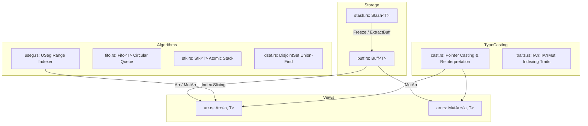

# Silo: Storage, Traversal & Memory Primitives

**Path:** `src/silo/`  
**Crate Member:** `trellis::silo`  
**Status:** Core Foundation Module

---

## 1. Module Overview & Mission

`silo` is Trellis's foundational memory, storage, and traversal subsystem. It was engineered from first principles to enforce explicit ownership, contiguous memory layout, index-based referencing with 32-bit offsets (`u32`), zero-copy slicing, and minimal allocator pressure.

### Design Principles
- **Contiguous Heap Storage**: Heavy preference for cache-local arrays over pointer-chasing linked graphs.
- **32-bit Indexing (`u32`)**: Most data sizes in Trellis fit within 4 billion elements. Using `u32` avoids 64-bit reference overhead in dense structures.
- **Borrowed Views (`Arr` / `MutArr`)**: Direct equivalents of slices (`&[T]` and `&mut [T]`) but designed to interoperate smoothly with C-style raw pointers, memory reinterpretation, and aliasing contracts.
- **Explicit Growth vs. Fixed Capacity**: Clear separation between dynamically growable accumulators (`Stash<T>`) and frozen, immutable heap buffers (`Buff<T>`).

---

## 2. Component Hierarchy & File Map



| File | Primary Types & Functions | Description |
|---|---|---|
| `buff.rs` | `Buff<T>`, `BuffGuard<T>` | Contiguous owned heap buffer with fixed capacity, panic-safe unwinding, and RAII deallocation. |
| `stash.rs` | `Stash<T>` | Amortized growable buffer; used during construction, can be frozen into a `Buff<T>`. |
| `arr.rs` | `Arr<'a, T>`, `MutArr<'a, T>` | Borrowed immutable and mutable array views with slice conversion and bounds-checked indexing. |
| `useg.rs` | `USeg` | Compact `[start, len)` range segment abstraction supporting binary search, partition, and snipping. |
| `fifo.rs` | `Fifo<T>` | Power-of-two circular ring buffer for FIFO queues. |
| `stk.rs` | `Stk<T>` | Lock-free / atomic stack representation using CAS operations. |
| `dset.rs` | `DisjointSet` | Array-backed disjoint-set (union-find) with path compression and rank optimization. |
| `cast.rs` | `ICastExt`, `IAllocRawExt`, etc. | Zero-copy reinterpretation traits for raw pointers and byte arrays. |
| `traits.rs` | `IArr`, `IArrMut` | Common indexing abstraction for containers exposing contiguous memory. |

---

## 3. Core Data Structures & Types

### 3.1 `Buff<T>`: Contiguous Fixed Heap Storage
`Buff<T>` is an owned, heap-allocated buffer of fixed length $N$. Unlike `Vec<T>`, it has no separate capacity field; its allocation size exactly equals its element count.
- **Memory Layout**: A single 64-bit pointer and a 32-bit count:
  ```rust
  pub struct Buff<T> {
      pub(crate) ptr: *mut T,
      pub(crate) len: u32,
  }
  ```
- **Drop Semantics**: In `drop`, it explicitly drops each element from $0 \dots N-1$, then deallocates the backing memory using Rust's global allocator layout.
- **Dispenser Constructor**: `Buff::FromDispenser(count, |idx| expr)` populates elements with RAII safety using an inner unwinding guard (`BuffGuard<T>`).

### 3.2 `Stash<T>`: Growable Builder
`Stash<T>` is a dynamic, growable buffer similar to `Vec<T>`, but with a specialized conversion method `.ExtractBuff()` that transfers heap ownership directly into a `Buff<T>` without reallocating if capacity matches length.
- **Growth Strategy**: $1.5\times$ or $2\times$ geometric growth.
- **Pre-allocation**: `Stash::WithCapacity(n)` ensures zero-allocation collection pipelines.

### 3.3 `Arr<'a, T>` & `MutArr<'a, T>`: Borrowed Array Slices
Explicit fat pointer views into contiguous storage:
- `Arr<'a, T>` holds `ptr: *const T`, `len: u32`, and `PhantomData<&'a T>`.
- `MutArr<'a, T>` holds `ptr: *mut T`, `len: u32`, and `PhantomData<&'a mut T>`.
- **Unsafe Aliasing**: `MutArr::Alias(&self) -> MutArr<'a, T>` allows unsafe explicit duplication when partitioning across non-overlapping worker indices.

### 3.4 `USeg`: Range & Index Traversal
`USeg` is an unsigned half-open interval $[start, start + len)$:
```rust
pub struct USeg {
    pub _Start: u32,
    pub _Len:   u32,
}
```
- Serves as the primary iteration and partitioning unit across Trellis (used in SIMT warps, buffer chunking, and mesh indexing).

---

## 4. Feature-by-Feature Deep Dive

### 4.1 Zero-Allocation Buffer Freezing
When assembling simulation models (e.g. in `rube` netlists or `karst` flit queues), dynamic accumulation is done via `Stash<T>`. Once the graph structure is validated, `.ExtractBuff()` seals the memory into an immutable `Buff<T>`, freeing unused capacity and preventing subsequent accidental modification.

### 4.2 Segmented Traversal and Snipping (`USeg`)
`USeg` provides algebraic range transformations:
- **`Overlap(other)`**: Calculates the intersection between two segments.
- **`Snip(cut)`**: Splits a segment around a sub-interval, returning up to two remaining non-overlapping segments.
- **`Traverse(closure)`**: Zero-cost traversal loop optimized for compiler vectorization.
- **`BinarySearch(key, lookup_fn)`**: In-place binary search over sorted arrays indexed by the segment.

### 4.3 Union-Find Disjoint Set (`DisjointSet`)
Used in circuit netlist flattening (`rube`) and geometric manifold validation (`fleck`):
- Flat contiguous arrays for parent IDs and ranks: `_Parent: Buff<u32>`, `_Rank: Buff<u32>`.
- Full path compression on `Find(x)` and rank-based merging on `Union(x, y)`.

### 4.4 Low-Level Cast and Pointer Slicing (`cast.rs`)
Allows casting raw byte buffers (`Buff<u8>`) directly into typed slices (`&[f32]`, `&[u32]`) when verified for alignment:
- `CastArrFrom::<T>()`: Reinterprets a raw byte stream as an `Arr<T>` with strict size and alignment verification.
- `CastMutArr::<T>()`: Mutable equivalent with bounds checking.

---

## 5. Memory & Ownership Topology

1. **Stack Footprint**: All Silo structs are lightweight (typically 12 or 16 bytes).
2. **Explicit Lifetimes**: `Arr<'a, T>` strictly bounds borrowed access to the parent `Buff<T>` or `Stash<T>`.
3. **No Hidden Reallocations**: `Buff<T>` never reallocates; `Stash<T>` only reallocates when pushed beyond capacity.

---

## 6. Integration Boundaries

- **Upstream Dependencies**: Pure Rust standard library core (`std::alloc`, `std::ptr`, `std::mem`). No third-party crate dependencies.
- **Downstream Consumers**:
  - `stalks`: Wraps Silo buffers for coroutine stacks and node pools.
  - `heist`: Uses `Stash` and `Buff` for worker queues and job tracking tables.
  - `rube`: Circuit connectivity arrays and trigger states.
  - `karst`: Interconnect queues, routing tables, and flit buffers.
  - `fleck`: Point cloud and vertex coordinate arrays.
