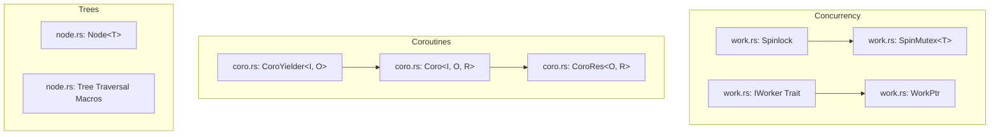

# Stalks: Synchronization, Work Primitives & Coroutines

**Path:** `src/stalks/`  
**Crate Member:** `trellis::stalks`  
**Status:** Core Foundation Module

---

## 1. Module Overview & Mission

`stalks` provides the synchronization primitives, abstract work interfaces, stackful coroutine runtimes, and reusable binary tree algorithms that underpin Trellis's concurrent schedulers (`heist`), simulation engines (`rube`, `karst`), and parsers (`shard`).

### Design Principles
- **Low-Latency Spinlocks**: CAS-based mutual exclusion with hardware CPU pauses (`std::hint::spin_loop()`) avoiding OS kernel context switches.
- **Unified Work Handles**: `WorkPtr` abstracts arbitrary callable closures into single-pointer task representations for thread pools.
- **Stackful Coroutines**: Integration with `corosensei` to provide true cooperative, multi-yield execution without color-coding the codebase with async/await.
- **Intrusive/Binary Node Primitives**: Generic binary node structures for expressions, grammar trees, and layout graphs.

---

## 2. Component Hierarchy & File Map



| File | Primary Types & Functions | Description |
|---|---|---|
| `work.rs` | `Spinlock`, `SpinMutex<T>`, `IWorker`, `WorkPtr` | CAS-based spinlocks, worker thread interfaces, and zero-sized/type-erased executable work handles. |
| `coro.rs` | `Coro<I, O, R>`, `CoroYielder<I, O>`, `CoroRes<O, R>`, `ICoro` | Stackful coroutine wrapper around `corosensei`, supporting input/output transfers during suspension. |
| `node.rs` | `Node<T>`, tree traversal macros | Generic binary node abstraction with left/right child pointers used in ASTs. |

---

## 3. Core Data Structures & Types

### 3.1 `Spinlock` & `SpinMutex<T>`
Modeled after Trellis C++ `stalks/atm.h`:
- `Spinlock`: Contains an `AtomicBool`. `Acquire()` executes a tight loop with `spin_loop()` until swapping `true` succeeds via `Ordering::Acquire`.
- `SpinMutex<T>`: Wraps an `UnsafeCell<T>` protected by `Spinlock`. Returns RAII guards (`SpinMutexGuard<T>`) implementing `Deref` and `DerefMut`.

### 3.2 `IWorker` & `WorkPtr`
- **`IWorker`**: Trait representing an active thread or execution context capable of receiving sub-jobs:
  ```rust
  pub trait IWorker {
      fn PostJob(&mut self, job: WorkPtr);
      fn WorkerIndex(&self) -> u32;
      fn EnqueueJobId(&mut self, job_id: u16);
      fn PostJobWithPlacement(&mut self, job: WorkPtr, placement_packed: u16, succ_id: u16);
      fn PublishSuccessor(&mut self, succ_id: u16);
      fn CurSuccId(&self) -> u16;
      fn SetCurSuccId(&mut self, val: u16);
  }
  ```
- **`WorkPtr`**: An encapsulated executable task. Implemented as an `Option<Box<dyn FnOnce(&mut dyn IWorker) + Send>>`. Contains convenience constructors `FromFn(fn)` and `FromClosure(closure)`.

### 3.3 Stackful Coroutines (`Coro<I, O, R>`)
Provides true stack-switching coroutines:
- **`I`**: Input payload passed on resumption (`Resume(input)`).
- **`O`**: Output payload yielded during suspension (`Suspend(output)`).
- **`R`**: Return payload yielded upon completion.
- **`CoroRes`**:
  ```rust
  pub enum CoroRes<O, R> {
      Yield(O),
      Done(R),
  }
  ```

---

## 4. Feature-by-Feature Deep Dive

### 4.1 Cooperative Execution via Coroutines
Unlike state-machine generator transforms (`async`/`await`), `stalks::coro` switches native CPU stacks:
1. When `Coro::New(closure)` is called, a separate execution stack is allocated by `corosensei`.
2. Inside the closure, the task receives a `CoroYielder`.
3. Calling `yielder.Suspend(output)` suspends the thread context, captures current registers, and restores the caller's stack frame, returning `CoroRes::Yield(output)`.
4. Subsequent calls to `coro.Resume(input)` resume exactly where execution stopped.

This is heavily utilized by:
- `rube`: Multi-cycle digital circuit modules that hold local state across simulation ticks.
- `karst`: Epoch-based independent fabric advancement (`AdvanceIndependentCoro`).

### 4.2 Reusable Binary AST Nodes (`node.rs`)
`Node<T>` represents an arbitrary binary tree structure:
- Supports left and right child pointers (`Option<Box<Node<T>>>`).
- Provides pre-order, in-order, and post-order depth-first traversal macros.
- Used in `fresco` (`TermTree`) and `shard` (grammar parsing graphs).

---

## 5. Execution Model & Concurrency

1. **Spin vs. Block**: In high-throughput simulation loops (such as Heist job queues), kernel context switches via OS mutexes introduce unacceptable jitter. `Spinlock` ensures thread transitions occur entirely in userspace.
2. **Coroutines and Thread Affinity**: A `Coro` is `Send`. While it is executing, it is bound to the thread calling `Resume()`. In `heist`, coroutines are pinned to specific workers (`Require(w)`) to maximize L1/L2 cache hits across yields.

---

## 6. Integration Boundaries

- **Upstream**: Standard library atomics, `corosensei`.
- **Downstream**:
  - `heist`: Uses `IWorker`, `WorkPtr`, and `SpinMutex` for all work-stealing job queues.
  - `rube`: Employs `Coro` for complex sequential logic units.
  - `karst`: Uses `Coro` for multi-worker fabric epoch stepping.
  - `fresco`: Builds mathematical expression trees on top of `Node<T>`.
