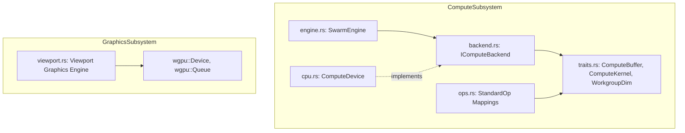

# Swarm: Unified Compute Abstraction & WGPU Viewport

**Path:** `src/swarm/`  
**Crate Member:** `trellis::swarm`  
**Status:** Compute & Graphics Host Subsystem

---

## 1. Module Overview & Mission

`swarm` has two central architectural responsibilities:
1. **Compute Abstraction (`SwarmEngine`)**: Hardware-neutral compute engine that maps abstract kernels (`ComputeKernel`) and memory buffers (`ComputeBuffer`) onto backend devices (`IComputeBackend`), specifically providing the built-in CPU backend (`ComputeDevice`).
2. **Interactive 3D Viewport (`viewport.rs`)**: Host graphics subsystem that interfaces directly with `wgpu` to manage render pipelines, depth buffers, orbit camera uniforms, and geometry rendering (triangles and point cloud splats) for the `fascia` desktop GUI.

### Design Principles
- **Backend Polymorphism**: Compute algorithms are written against abstract `ComputeBuffer` and `ComputeKernel` types, with device selection happening at runtime.
- **Resource Re-use in Viewport**: Geometry uploads (`GeometryAsset`) are cached in GPU VRAM; window resizing updates offscreen render targets without re-uploading meshes.
- **Explicit Scoped Dispatch**: `ComputeDevice::DispatchScoped` integrates directly with `heist::Atelier` for multithreaded CPU parallel execution with partitioned outputs.

---

## 2. Component Hierarchy & File Map



| File | Primary Types & Functions | Description |
|---|---|---|
| `engine.rs` | `SwarmEngine` | Top-level compute orchestrator exposing `RunStandardOp` across configured backends. |
| `backend.rs` | `IComputeBackend` | Trait defining backend capabilities: device creation, buffer allocation, kernel compilation, and dispatch. |
| `cpu.rs` | `ComputeDevice` | Default CPU compute backend executing kernels across host cores via `heist` or serial fast paths. |
| `traits.rs` | `ComputeBuffer`, `ComputeKernel`, `WorkgroupDim`, `BackendKind`, `SwarmError` | Abstract compute types representing linear memory allocations, compiled kernels, and grid dimensions. |
| `ops.rs` | `StandardOp`, `StandardOpLabel`, `StandardOpKernelSource` | Cross-backend mapping connecting standard operations (`Double`, `Collatz`, `VectorAdd`) to CPU closures or SPIR-V/WGSL code. |
| `viewport.rs` | `Viewport` | WGPU 3D graphics renderer handling camera uniforms, vertex buffers, offscreen textures, and composite passes. |

---

## 3. Core Data Structures & Types

### 3.1 `WorkgroupDim`
Specifies 3D dispatch dimensions:
```rust
#[derive(Clone, Copy, Debug, PartialEq, Eq)]
pub struct WorkgroupDim {
    pub _X: u32,
    pub _Y: u32,
    pub _Z: u32,
}
```

### 3.2 `ComputeBuffer` & `ComputeKernel`
- **`ComputeBuffer`**: Manages underlying storage:
  - In CPU mode: Backed by `silo::Buff<u8>`. Supports zero-copy typed slicing via `.WithMut()` and `.WithInputOutput()`.
  - In GPU mode: Backed by `wgpu::Buffer`.
- **`ComputeKernel`**: Encapsulates a compiled shader or host function pointer, retaining metadata such as `StandardOp`.

### 3.3 `Viewport`
Maintains GPU rendering resources inside `fascia`:
- `_PipelineMesh`: Render pipeline compiling `symph/viewport.wgsl` with triangle topology and backface culling.
- `_PipelinePoints`: Render pipeline for point clouds with point-list topology.
- `_UniformBuffer`: GPU buffer holding `symph::CameraUniforms`.
- `_ColorTexture`, `_DepthTexture`: Offscreen multi-sample render targets.

---

## 4. Feature-by-Feature Deep Dive

### 4.1 Built-In CPU Compute Device (`cpu.rs`)
`ComputeDevice` provides two dispatch modes:
1. **Serial `Dispatch`**: For small workgroup sizes (under invocation threshold), runs sequentially on the calling thread to avoid thread pool synchronization overhead.
2. **Parallel `DispatchScoped`**: Constructs or borrows an `Atelier`, partitions the output buffer via `flock::CpuOutputPartition`, and executes work in parallel across all worker cores.

### 4.2 Interactive Viewport Orbit Camera (`viewport.rs`)
The viewport translates user mouse gestures from `fascia` into camera transformations:
- Computes view-projection matrices using `glam::Mat4::perspective_rh` and `glam::Mat4::look_at_rh`.
- Writes the updated matrix into `_UniformBuffer` using `wgpu::Queue::write_buffer`.

---

## 5. Integration Boundaries

- **Upstream Dependencies**: `silo`, `stalks`, `heist`, `flock`, `symph`, `drove`, `wgpu`, `glam`.
- **Downstream Consumers**:
  - `karst`: Memory controllers and VPUs dispatch compute kernels using `ComputeDevice`.
  - `fascia`: Hosts the 3D viewport canvas inside the desktop application tabs.
