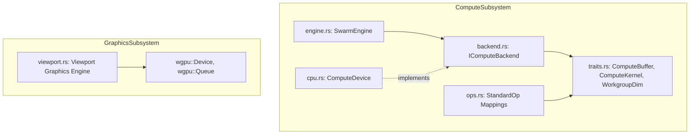

# Swarm: Unified Compute Abstraction & WGPU Viewport

**Path:** `src/swarm/`  
**Crate Member:** `trellis::swarm`  
**Status:** Compute & Graphics Host Subsystem

---

## 1. Module Overview & Mission

`swarm` has two central architectural responsibilities:
1. **Compute Abstraction (`SwarmEngine`)**: Hardware-neutral compute engine that maps abstract kernels (`ComputeKernel`) and memory buffers (`ComputeBuffer`) onto backend devices (`IComputeBackend`), specifically providing the built-in CPU backend (`ComputeDevice`).
2. **Interactive 3D Viewport (`viewport.rs`)**: Host graphics subsystem that interfaces directly with `wgpu` to manage render pipelines, depth buffers, orbit camera uniforms, and geometry rendering (triangles and point cloud splats) for the `fascia` desktop GUI.

### Design Principles
- **Backend Polymorphism**: Compute algorithms are written against abstract `ComputeBuffer` and `ComputeKernel` types, with device selection happening at runtime.
- **Resource Re-use in Viewport**: Geometry uploads (`GeometryAsset`) are cached in GPU VRAM; window resizing updates offscreen render targets without re-uploading meshes.
- **Explicit Scoped Dispatch**: `ComputeDevice::DispatchScoped` integrates directly with `heist::Atelier` for multithreaded CPU parallel execution with partitioned outputs.

---

## 2. Component Hierarchy & File Map


```mermaid
flowchart TD
    subgraph ComputeSubsystem
        Engine[engine.rs: SwarmEngine]
        Backend[backend.rs: IComputeBackend]
        CpuDevice[cpu.rs: ComputeDevice]
        Traits[traits.rs: ComputeBuffer, ComputeKernel, WorkgroupDim]
        Ops[ops.rs: StandardOp Mappings]
    end
    subgraph GraphicsSubsystem
        Viewport[viewport.rs: Viewport Graphics Engine]
        Wgpu[wgpu::Device, wgpu::Queue]
    end

    Engine --> Backend
    CpuDevice -.->|implements| Backend
    Backend --> Traits
    Ops --> Traits
    Viewport --> Wgpu
```

| File | Primary Types & Functions | Description |
|---|---|---|
| `engine.rs` | `SwarmEngine` | Compute orchestration through `ExecuteOp`, `DispatchWith`, and `ExecuteWith`. |
| `backend.rs` | `IComputeBackend` | Trait defining backend capabilities: device creation, buffer allocation, kernel compilation, and dispatch. |
| `cpu.rs` | `ComputeDevice` | Default CPU compute backend executing kernels across host cores via `heist` or serial fast paths. |
| `traits.rs` | `ComputeBuffer`, `ComputeKernel`, `WorkgroupDim`, `BackendKind`, `SwarmError` | Abstract compute types representing linear memory allocations, compiled kernels, and grid dimensions. |
| `ops.rs` | `StandardOp`, `StandardOpLabel`, `StandardOpKernelSource` | Cross-backend mapping connecting standard operations (`Double`, `Collatz`, `VectorAdd`) to CPU closures or SPIR-V/WGSL code. |
| `viewport.rs` | `Viewport` | WGPU 3D graphics renderer handling camera uniforms, vertex buffers, offscreen textures, and composite passes. |

---

## 3. Core Data Structures & Types

### 3.1 `WorkgroupDim`
Specifies 3D dispatch dimensions through constructors and read accessors:
```rust
let dim = WorkgroupDim::New( 4, 2, 1);
assert_eq!( dim.X(), 4);
assert_eq!( dim.Y(), 2);
assert_eq!( dim.Z(), 1);
```
`Linear(x)` creates `(x, 1, 1)`. Fields remain private, as do `BufferUsage` flags
(inspect with `Bits()`), `KernelSource` storage (`Kind()`, `Code()`, `ByteCode()`,
`Closure()`), and error details (`SwarmError::Kind()` / `Message()`).

### 3.2 `ComputeBuffer` & `ComputeKernel`
- **`ComputeBuffer`**: Owns CPU bytes in `silo::Buff<u8>` behind a lock. Internal scoped borrowing helpers avoid copies during dispatch. Capacity must fit `u32`; `ReadAt` and `WriteAt` reject invalid offsets without overflowing offset arithmetic, and allow empty transfers at the exact end of the buffer.
- **Backend resources**: `IComputeBackend` has associated buffer and kernel types, allowing hardware implementations to own their native resources. A non-CPU `ComputeDevice` reports `UnsupportedBackend` for execution and kernel compilation.
- **`ComputeKernel`**: Encapsulates a compiled shader or host function pointer, retaining metadata such as `StandardOp`.

### 3.3 `Viewport`
Maintains GPU rendering resources inside `fascia`:
- `_PipelineMesh`: Render pipeline compiling `symph/viewport.wgsl` with triangle topology and backface culling.
- `_PipelinePoints`: Render pipeline for point clouds with point-list topology.
- Camera data uses the renderer's private `ViewUniforms` layout, supplied through `ViewFrame`.
- `_ColorTexture`, `_DepthTexture`: Offscreen multi-sample render targets.

---

## 4. Feature-by-Feature Deep Dive

### 4.1 Built-In CPU Compute Device (`cpu.rs`)
CPU compilation accepts `KernelSource::Cpu` closures or explicit standard operation
sources from `StandardOpKernelSource(op, BackendKind::Cpu)`. WGSL, PTX, and SPIR-V
sources return `InvalidKernelSource`; labels and shader text never select a CPU
operation implicitly. Standard CPU closures are shared with Flock. Camera dispatch
prepares `symph::CameraProjection` once and computes all six output values together
for each point.

`ComputeDevice` provides two dispatch modes:

1. **Serial `Dispatch`**: Runs on the calling thread, including optimized standard operation paths.
2. **Parallel `DispatchScoped`**: Borrows an `Atelier` for supported standard operations, partitions the output buffer via `flock::CpuOutputPartition`, and executes across its workers.

### 4.2 Interactive Viewport Orbit Camera (`viewport.rs`)
The viewport translates user mouse gestures from `fascia` into camera transformations:
- Computes view-projection matrices using `glam::Mat4::perspective_rh` and `glam::Mat4::look_at_rh`.
- Writes the updated matrix into `_UniformBuffer` using `wgpu::Queue::write_buffer`.

---

## 5. Integration Boundaries

- **Upstream Dependencies**: `silo`, `stalks`, `heist`, `flock`, `symph`, `drove`, `wgpu`, `glam`.
- **Downstream Consumers**:
  - `karst`: Memory controllers and VPUs dispatch compute kernels using `ComputeDevice`.
  - `fascia`: Hosts the 3D viewport canvas inside the desktop application tabs.
