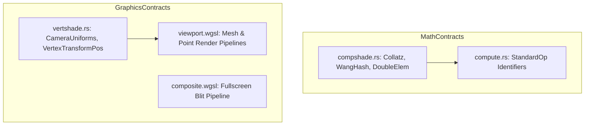

# Symph: Portable Math, Shader Logic & Uniform Contracts

**Path:** `src/symph/`  
**Crate Member:** `trellis::symph`  
**Status:** Compute & Graphics Math Framework

---

## 1. Module Overview & Mission

`symph` serves as the bridge between host Rust code and GPU shader execution. It houses mathematical functions (such as hashing algorithms and numerical sequences), uniform buffer layouts, vertex transformation contracts, and active WebGPU Shading Language (WGSL) shaders used by `swarm::viewport`.

### Design Principles
- **Cross-Platform Math Parity**: Math functions (like `WangHash` or `Collatz`) are written to execute identically on CPU and GPU.
- **Strict Memory Alignment (`bytemuck`)**: Uniform structs (`CameraUniforms`) conform to WebGPU WGSL uniform alignment rules (16-byte alignment).
- **Embedded WGSL Shaders**: Active shaders (`viewport.wgsl`, `composite.wgsl`) are bundled directly into the module.

---

## 2. Component Hierarchy & File Map



| File | Primary Types & Functions | Description |
|---|---|---|
| `compshade.rs` | `WangHash`, `HashToFloat`, `Collatz`, `DoubleElem` | Portable computational algorithms shared between CPU kernels and shaders. |
| `compute.rs` | `StandardOp`, `StandardOpLabel` | Standard operation identities (`Double`, `Collatz`, `VectorAdd`, etc.). |
| `vertshade.rs` | `CameraUniforms`, `VertexTransformPos`, `Vec2/3/4` | Uniform layout definitions for view/projection matrices, eye position, and light directions. |
| `viewport.wgsl` | WGSL shader code | Vertex and fragment shaders rendering 3D mesh triangles and point cloud splats. |
| `composite.wgsl` | WGSL shader code | Full-screen composition shader applying post-processing and alpha blending. |

---

## 3. Core Data Structures & Types

### 3.1 `CameraUniforms` (WGSL Uniform Contract)
Annotated with `bytemuck::Pod` and `bytemuck::Zeroable`:
```rust
#[repr(C)]
#[derive(Clone, Copy, Debug, bytemuck::Pod, bytemuck::Zeroable)]
pub struct CameraUniforms {
    pub view_proj:  [[f32; 4]; 4],
    pub camera_pos: [f32; 4],
    pub light_dir:  [f32; 4],
}
```

### 3.2 Integer & Hashing Algorithms
- **`WangHash(seed: u32) -> u32`**: High-quality 32-bit integer pseudo-random hash.
- **`HashToFloat(hash: u32) -> f32`**: Maps integer hashes uniformly into the normalized range $[0.0, 1.0)$.
- **`Collatz(n: u32) -> u32`**: Evaluates steps to reach 1 in the $3n + 1$ conjecture.

---

## 4. Integration Boundaries

- **Upstream Dependencies**: `glam`, `bytemuck`.
- **Downstream Consumers**:
  - `flock`: Uses `compshade` math functions for CPU kernel equivalence.
  - `swarm::viewport`: Uploads `CameraUniforms` and compiles `viewport.wgsl` into `wgpu::RenderPipeline`.
  - `drove`: Verifies host math contracts against Rust-GPU SPIR-V shaders.
