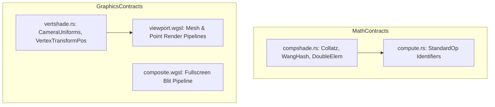

# Symph: Portable Math, Shader Logic & Uniform Contracts

**Path:** `src/symph/`  
**Crate Member:** `trellis::symph`  
**Status:** Compute & Graphics Math Framework

---

## 1. Module Overview & Mission

`symph` serves as the bridge between host Rust code and GPU shader execution. It houses mathematical functions (such as hashing algorithms and numerical sequences), uniform buffer layouts, vertex transformation contracts, and active WebGPU Shading Language (WGSL) shaders used by `swarm::viewport`.

### Design Principles
- **Cross-Platform Math Parity**: Math functions (like `WangHash` or `Collatz`) are written to execute identically on CPU and GPU.
- **Explicit Camera Buffer Contract**: `CameraUniforms::FromValues` and `Values` convert the 13-float compute parameter sequence without relying on Rust struct layout.
- **Reusable Projection**: `CameraProjection` prepares an immutable camera snapshot and rotation coefficients for repeated point transforms.
- **Embedded WGSL Shaders**: Active shaders (`viewport.wgsl`, `composite.wgsl`) are bundled directly into the module.

---

## 2. Component Hierarchy & File Map

```mermaid
flowchart TD
    subgraph MathContracts
        CompShade[compshade.rs: Collatz, WangHash, DoubleElem]
        Compute[compute.rs: StandardOp Identifiers]
    end
    subgraph GraphicsContracts
        VertShade[vertshade.rs: CameraUniforms, VertexTransformPos]
        ViewportWgsl[viewport.wgsl: Mesh & Point Render Pipelines]
        CompositeWgsl[composite.wgsl: Fullscreen Blit Pipeline]
    end

    CompShade --> Compute
    VertShade --> ViewportWgsl
```

| File | Primary Types & Functions | Description |
|---|---|---|
| `compshade.rs` | `WangHash`, `HashToFloat`, `Collatz`, `DoubleElem` | Portable computational algorithms shared between CPU kernels and shaders. |
| `compute.rs` | `StandardOp`, `StandardOpLabel` | Standard operation identities (`Double`, `Collatz`, `VectorAdd`, etc.). |
| `vertshade.rs` | `CameraUniforms`, `CameraProjection`, `VertexTransformPos`, `Vec2/3/4` | Camera parameter conversion and shared point projection math. |
| `viewport.wgsl` | WGSL shader code | Vertex and fragment shaders rendering 3D mesh triangles and point cloud splats. |
| `composite.wgsl` | WGSL shader code | Full-screen composition shader applying post-processing and alpha blending. |

---

## 3. Core Data Structures & Types

### 3.1 Camera Parameters and Projection
`CameraUniforms` keeps its fields private. `FromValues(Arr<f32>)` reads rotation X/Y,
zoom, pan X/Y, focal scale, distance, viewport width/height, center X/Y/Z, and
normalization scale, in that order. It returns `None` for fewer than `VALUE_COUNT`
(13) values. `Values()` returns the same sequence for buffer serialization.

Construct `CameraProjection::New(&camera)` once per batch. `Project(&point)` returns
screen X/Y, radius, core radius, alpha, and depth factor. `Transform(&point)` returns
clip coordinates, point size, and depth factor. `VertexTransformPos` remains the
convenience entry point for a single point. Swarm's optimized camera kernel and
Flock's generic CPU kernel share this math.

The viewport renderer owns a separate private `ViewUniforms` matrix layout in
`swarm/viewport.rs`; `CameraUniforms` is not a `bytemuck::Pod` GPU uniform struct.

### 3.2 Integer & Hashing Algorithms
- **`WangHash(seed: u32) -> u32`**: High-quality 32-bit integer pseudo-random hash.
- **`HashToFloat(hash: u32) -> f32`**: Maps integer hashes uniformly into the normalized range $[0.0, 1.0)$.
- **`Collatz(n: u32) -> u32`**: Evaluates steps to reach 1 in the $3n + 1$ conjecture.

---

## 4. Integration Boundaries

- **Upstream Dependencies**: `silo` for borrowed camera parameter views.
- **Downstream Consumers**:
  - `flock`: Uses `compshade` math functions for CPU kernel equivalence.
  - `swarm`: Reuses prepared camera projection for CPU compute; its viewport renderer consumes the embedded shaders through `drove`.
  - `drove`: Verifies host math contracts against Rust-GPU SPIR-V shaders.
