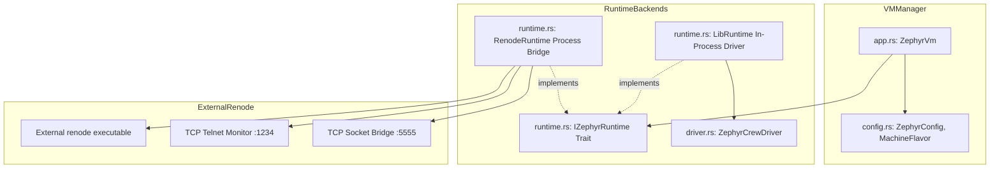

# Zephyr: Guest Virtual Machine Lifecycle & Emulation Runtime

**Path:** `src/zephyr/`  
**Crate Member:** `trellis::zephyr`  
**Status:** Guest VM & Processor Emulation Subsystem

---

## 1. Module Overview & Mission

`zephyr` orchestrates the lifecycle and execution of guest processor virtual machines inside Trellis. It abstracts machine startup, stepping, memory inspection, and shutdown across multiple runtime backends (`IZephyrRuntime`), specifically providing:
1. **`LibRuntime`**: An in-process, pure Rust simulation driver (`ZephyrCrewDriver`) simulating guest CPU firmware logic directly.
2. **`RenodeRuntime`**: A managed external process controller that boots an actual RISC-V platform emulator (Renode), controls execution over a TCP telnet monitor, and bridges MMIO traffic into `crew::CrewHub`.

### Design Principles
- **Runtime Polymorphism (`IZephyrRuntime`)**: Identical management interface regardless of whether the VM is an in-process mock, an external Renode emulator, or a future hypervisor.
- **Deterministic State Transitions**: Rigid state machine (`Uninitialized`, `Halted`, `Running`, `Stepping`, `Error`).
- **Clean Subprocess Management**: Automatically launches, monitors, and terminates external emulator instances, capturing stdout/stderr into diagnostic logs.

---

## 2. Component Hierarchy & File Map



| File | Primary Types & Functions | Description |
|---|---|---|
| `app.rs` | `ZephyrVm` | Primary user-facing VM controller exposing `Start()`, `Stop()`, `Step()`, `Reset()`, and `State()`. |
| `config.rs` | `ZephyrConfig`, `MachineFlavor`, `PlatformConfig` | Configuration settings: platform description (`.repl`), startup script (`.resc`), ELF binary path, port numbers. |
| `runtime.rs` | `IZephyrRuntime`, `LibRuntime`, `RenodeRuntime`, `VmState` | Backend runtime trait, state machine types, and execution drivers. |
| `driver.rs` | `ZephyrCrewDriver` | Host-side bus master driver providing high-level send/receive routines over `crew::CrewHub`. |
| `shm.rs` | Shared memory primitives | Reserved transport layer (currently not in the active module graph). |

---

## 3. Core Data Structures & Types

### 3.1 `VmState` State Machine
```rust
#[derive(Clone, Copy, Debug, PartialEq, Eq)]
pub enum VmState {
    Uninitialized,
    Halted,
    Running,
    Stepping,
    Terminated,
    Error,
}
```

### 3.2 `IZephyrRuntime` Trait
```rust
pub trait IZephyrRuntime: Send + Sync {
    fn Start(&mut self) -> Result<(), String>;
    fn Step(&mut self, instructions: u64) -> Result<(), String>;
    fn Stop(&mut self) -> Result<(), String>;
    fn Reset(&mut self) -> Result<(), String>;
    fn State(&self) -> VmState;
    fn ReadRegister(&self, reg: &str) -> Result<u64, String>;
}
```

---

## 4. Feature-by-Feature Deep Dive

### 4.1 In-Process Rust Driver (`LibRuntime`)
Provides ultra-fast, zero-overhead testing for co-simulation protocol logic without needing an external emulator installed. `ZephyrCrewDriver` acts as the virtual CPU, directly manipulating `crew::CrewHub` MMIO registers.

### 4.2 Managed Renode Integration (`RenodeRuntime`)
For real RISC-V firmware execution:
1. Spawns `renode --plain --port 1234 ...` as a child process.
2. Connects to Renode's telnet CLI monitor over TCP.
3. Issues `start`, `pause`, and `step` commands.
4. Starts a background listener thread to accept socket connections from `crew_pydev.py`, piping memory reads and writes directly into Trellis.

---

## 5. Integration Boundaries

- **Upstream Dependencies**: `crew` (`CrewHub`, `ProtocolMessage`).
- **Downstream Consumers**: Used in bare-metal RISC-V co-simulation testing (`tools/zephyr-firmware/app/`).
