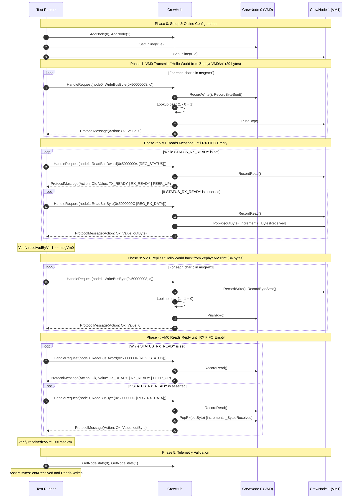

# Virtual Exchange Protocol

## Purpose & Scope

The `VirtualExchangeProtocol` test suite in `crew` ([`crew_tests.cpp`](file:///c:/Work/Oogway/Trellis/src/crew/tests/crew_tests.cpp#L254-L353)) verifies deterministic, bidirectional Memory-Mapped I/O (MMIO) communication between virtual machines (VM0 and VM1) without operating system socket dependencies.

It serves as the gold-standard in-memory reference implementation for Trellis's VM co-simulation stack, validating:
1. The 24-byte binary wire protocol ([`ProtocolMessage`](file:///c:/Work/Oogway/Trellis/src/crew/protocol.h#L53-L60)) compatible with Renode's `CoSimulatedPlugin`.
2. MMIO register address decoding, status flag logic, and FIFO queueing.
3. Peer-to-peer byte routing across isolated VM node contexts ([`CrewNode`](file:///c:/Work/Oogway/Trellis/src/crew/node.h#L28-L119)) governed by a central coordinator ([`CrewHub`](file:///c:/Work/Oogway/Trellis/src/crew/hub.h#L26-L45)).
4. Telemetry tracking for reads, writes, and bytes transferred.

The identical protocol and register specifications are executed in hardware-synthesized netlists via Rube ([`VMAdaptor`](file:///c:/Work/Oogway/Trellis/src/crew/vm_adaptor.h#L47-L283)) and in bare-metal guest firmware via Zephyr OS ([`main.c`](file:///c:/Work/Oogway/Trellis/src/zephyr/src/main.c#L1-L114)).

---

## Architectural Components

```text
               +-------------------------------------------------------------+
               |                           CrewHub                           |
               |  - Manages node lifecycles & lookups                        |
               |  - Decodes CoSimAction & registers                          |
               |  - Routes bytes to peer FIFOs                               |
               |  - Fires MessageCallback telemetry                          |
               +------------------------------+------------------------------+
                                              |
                     +------------------------+------------------------+
                     | HandleRequest(node0)                            | HandleRequest(node1)
                     v                                                 v
   +------------------------------------+            +------------------------------------+
   |          CrewNode (VM0)            |            |          CrewNode (VM1)            |
   |  - Id: 0                           |            |  - Id: 1                           |
   |  - IsOnline: true                  |            |  - IsOnline: true                  |
   |  - RxQueue: std::deque<uint8_t>    |            |  - RxQueue: std::deque<uint8_t>    |
   |  - Stats: NodeStats                |            |  - Stats: NodeStats                |
   |    * _BytesSent                    |            |    * _BytesSent                    |
   |    * _BytesReceived                |            |    * _BytesReceived                |
   |    * _ReadsServiced                |            |    * _ReadsServiced                |
   |    * _WritesServiced               |            |    * _WritesServiced               |
   +------------------------------------+            +------------------------------------+
```

### 1. `ProtocolMessage`
A 24-byte packed binary struct exchanged between virtual machines and the `CrewHub`:

| Field | Type | Size | Description |
|---|---|---|---|
| `_ActionId` | `int32_t` | 4 bytes | Co-simulation command ID ([`CoSimAction`](file:///c:/Work/Oogway/Trellis/src/crew/protocol.h#L13-L47)) |
| `_Addr` | `uint64_t` | 8 bytes | Physical MMIO address (base `0x50000000` + register offset) |
| `_Value` | `uint64_t` | 8 bytes | Data payload (written byte/dword or read result) |
| `_PeripheralIndex` | `int32_t` | 4 bytes | Peripheral identifier index (-1 for default) |

### 2. MMIO Register Map (Base Address: `0x50000000`)

Offsets are extracted using bitmask `req._Addr & 0xFFF`:

| Offset | Name | Mode | Description |
|---|---|---|---|
| `0x000` | `REG_NODE_ID` | RO | Returns the current node ID (`0` or `1`) |
| `0x004` | `REG_STATUS` | RO | Status bitmask: bit 0 = `TX_READY`, bit 1 = `RX_READY`, bit 2 = `PEER_UP` |
| `0x008` | `REG_TX_DATA` | WO | Writing a byte routes it into the peer node's RX FIFO |
| `0x00C` | `REG_RX_DATA` | RO | Reading pops one byte from the local node's RX FIFO |
| `0x010` | `REG_RX_COUNT` | RO | Returns number of bytes currently buffered in local RX FIFO |

### 3. Status Flags

- `STATUS_TX_READY (1U << 0)`: Local node is capable of transmitting. Always set in `CrewHub`.
- `STATUS_RX_READY (1U << 1)`: Asserted whenever the local node's `RxCount() > 0`.
- `STATUS_PEER_UP (1U << 2)`: Asserted whenever the peer node (`1 - Id()`) is online.

---

## Detailed Control Flow

The `VirtualExchangeProtocol` test executes across five sequential phases:



---

### Phase 0: Topology & State Initialization

```cpp
CrewHub hub;
hub.AddNode(0);
hub.AddNode(1);

auto node0 = hub.FindNode(0);
auto node1 = hub.FindNode(1);
node0->SetOnline(true);
node1->SetOnline(true);
```

1. `hub.AddNode(id)` allocates a heap-managed [`CrewNode`](file:///c:/Work/Oogway/Trellis/src/crew/node.h#L28-L119) inside `_Nodes` ([`silo::Stash`](file:///c:/Work/Oogway/Trellis/src/silo/stash.h)).
2. `node->SetOnline(true)` stores `true` in `_IsOnline` (`stalks::Atm<bool>`).
3. Message strings are defined:
   - `msgVm0`: `"Hello World from Zephyr VM0!\n"` (29 bytes)
   - `msgVm1`: `"Hello World back from Zephyr VM1!\n"` (34 bytes)

---

### Phase 1: VM0 MMIO Transmission Loop

```cpp
for (char c : msgVm0) {
    ProtocolMessage req{};
    req._ActionId = static_cast<int32_t>(CoSimAction::WriteBusByte);
    req._Addr = 0x50000000ULL | REG_TX_DATA;
    req._Value = static_cast<uint8_t>(c);
    hub.HandleRequest(node0, req);
}
```

For each character `c`:
1. **Request Formulation**: A 24-byte `ProtocolMessage` is configured with `_ActionId = CoSimAction::WriteBusByte` (25), `_Addr = 0x50000008`, and `_Value = c`.
2. **Dispatch ([`CrewHub::HandleRequest`](file:///c:/Work/Oogway/Trellis/src/crew/hub.cpp#L69-L154))**:
   - `resp` initialized with `CoSimAction::Ok` (9), echoing `_Addr` and `_PeripheralIndex`.
   - Action matches write branch: calls `node0->RecordWrite()` to increment `_WritesServiced`.
   - Masked register `req._Addr & 0xFFF` matches `REG_TX_DATA` (`0x008`).
   - Byte extracted: `uint8_t byte = req._Value & 0xFF`.
   - Node 0 records transmission: calls `node0->RecordByteSent()` to increment `_BytesSent`.
   - Destination computed: `peerId = 1 - node0->Id()` (`1`).
   - Peer node retrieved: `peer = FindNode(1)`.
   - Byte enqueued: `peer->PushRx(byte)` acquires `node1->_Lock` and appends to `_RxQueue`.
   - If a `_MessageCb` is registered, `_MessageCb(0, 1, byte)` is invoked.
3. **Response**: Returns `ProtocolMessage` with `_ActionId = CoSimAction::Ok`.

**Post-Phase 1 State**:
- Node 1 `_RxQueue`: contains 29 bytes (`"Hello World from Zephyr VM0!\n"`).
- Node 0 telemetry: `_WritesServiced = 29`, `_BytesSent = 29`, `_ReadsServiced = 0`, `_BytesReceived = 0`.

---

### Phase 2: VM1 Polling & Reception Loop

```cpp
std::string receivedByVm1;
while (true) {
    ProtocolMessage statusReq{};
    statusReq._ActionId = static_cast<int32_t>(CoSimAction::ReadBusDword);
    statusReq._Addr = 0x50000000ULL | REG_STATUS;
    ProtocolMessage statusResp = hub.HandleRequest(node1, statusReq);

    if (!(statusResp._Value & STATUS_RX_READY)) {
        break;
    }

    ProtocolMessage rxReq{};
    rxReq._ActionId = static_cast<int32_t>(CoSimAction::ReadBusByte);
    rxReq._Addr = 0x50000000ULL | REG_RX_DATA;
    ProtocolMessage rxResp = hub.HandleRequest(node1, rxReq);

    receivedByVm1.push_back(static_cast<char>(rxResp._Value & 0xFF));
}
```

The receiver iterates through a two-step polling cycle:

#### 1. Status Check (`REG_STATUS`)
- `statusReq` specifies `ReadBusDword` at `0x50000004`.
- `HandleRequest` invokes `node1->RecordRead()`.
- Register logic evaluates flags:
  - Base status: `STATUS_TX_READY` (`0x1`).
  - `node1->RxCount() > 0`: Since bytes remain in `_RxQueue`, bit `STATUS_RX_READY` (`0x2`) is OR'd.
  - `IsNodeOnline(0)`: Node 0 is online, so `STATUS_PEER_UP` (`0x4`) is OR'd.
  - `statusResp._Value = 0x7` (`TX_READY | RX_READY | PEER_UP`).
- Receiver checks `statusResp._Value & STATUS_RX_READY`. While non-zero, it proceeds to read data.

#### 2. Byte Extraction (`REG_RX_DATA`)
- `rxReq` specifies `ReadBusByte` at `0x5000000C`.
- `HandleRequest` invokes `node1->RecordRead()`.
- Register logic invokes `node1->PopRx(byte)`:
  - Takes `node1->_Lock`.
  - Pops front element from `_RxQueue`.
  - Increments `node1->_Stats._BytesReceived`.
- Byte returned in `rxResp._Value`.
- Byte appended to `receivedByVm1`.

#### 3. Exit Condition
- When all 29 characters are drained, the subsequent `REG_STATUS` read finds `node1->RxCount() == 0`.
- Status returns `0x5` (`STATUS_TX_READY | STATUS_PEER_UP`) without `STATUS_RX_READY`.
- Condition `!(statusResp._Value & STATUS_RX_READY)` evaluates to `true`, breaking the loop.
- Assertion verified: `JEEVES_ASSERT_EQ(receivedByVm1, msgVm0)`.

**Post-Phase 2 State**:
- Node 1 `_RxQueue`: empty.
- Node 1 reads: 29 successful status reads + 29 data reads + 1 terminating status read = **59 reads**.
- Node 1 received bytes: **29 bytes**.

---

### Phase 3: VM1 Transmission of Echo Reply

```cpp
for (char c : msgVm1) {
    ProtocolMessage req{};
    req._ActionId = static_cast<int32_t>(CoSimAction::WriteBusByte);
    req._Addr = 0x50000000ULL | REG_TX_DATA;
    req._Value = static_cast<uint8_t>(c);
    hub.HandleRequest(node1, req);
}
```

- VM1 sends 34 bytes (`msgVm1 = "Hello World back from Zephyr VM1!\n"`).
- Symmetrical to Phase 1:
  - Increments `node1->_WritesServiced` by 34.
  - Increments `node1->_BytesSent` by 34.
  - Directs each byte to peer node `1 - 1 = 0`.
  - Pushes bytes into `node0->_RxQueue`.

**Post-Phase 3 State**:
- Node 0 `_RxQueue`: contains 34 bytes.
- Node 1 telemetry: `_WritesServiced = 34`, `_BytesSent = 34`.

---

### Phase 4: VM0 Reception of Echo Reply

```cpp
std::string receivedByVm0;
while (true) {
    ProtocolMessage statusReq{};
    statusReq._ActionId = static_cast<int32_t>(CoSimAction::ReadBusDword);
    statusReq._Addr = 0x50000000ULL | REG_STATUS;
    ProtocolMessage statusResp = hub.HandleRequest(node0, statusReq);

    if (!(statusResp._Value & STATUS_RX_READY)) {
        break;
    }

    ProtocolMessage rxReq{};
    rxReq._ActionId = static_cast<int32_t>(CoSimAction::ReadBusByte);
    rxReq._Addr = 0x50000000ULL | REG_RX_DATA;
    ProtocolMessage rxResp = hub.HandleRequest(node0, rxReq);

    receivedByVm0.push_back(static_cast<char>(rxResp._Value & 0xFF));
}
```

- Symmetrical to Phase 2:
  - VM0 reads `REG_STATUS` and `REG_RX_DATA` until `node0->_RxQueue` is exhausted.
  - Pops all 34 bytes into `receivedByVm0`.
  - Assertion verified: `JEEVES_ASSERT_EQ(receivedByVm0, msgVm1)`.

**Post-Phase 4 State**:
- Node 0 reads: 34 successful status reads + 34 data reads + 1 terminating status read = **69 reads**.
- Node 0 received bytes: **34 bytes**.

---

### Phase 5: Telemetry Accounting & Assertions

```cpp
NodeStats s0 = hub.GetNodeStats(0);
NodeStats s1 = hub.GetNodeStats(1);

JEEVES_ASSERT_EQ(s0._BytesSent, static_cast<uint32_t>(msgVm0.size()));       // 29
JEEVES_ASSERT_EQ(s0._BytesReceived, static_cast<uint32_t>(msgVm1.size()));   // 34
JEEVES_ASSERT_EQ(s1._BytesSent, static_cast<uint32_t>(msgVm1.size()));       // 34
JEEVES_ASSERT_EQ(s1._BytesReceived, static_cast<uint32_t>(msgVm0.size()));   // 29
```

#### Final Telemetry Audit

| Metric | VM0 (Node 0) | VM1 (Node 1) | Derivation Formula |
|---|---|---|---|
| `_BytesSent` | **29** | **34** | Byte count of outgoing string |
| `_BytesReceived` | **34** | **29** | Byte count of incoming string |
| `_WritesServiced` | **29** | **34** | Exactly 1 `WriteBusByte` per character |
| `_ReadsServiced` | **69** | **59** | `(BytesReceived * 2) + 1` (1 status poll + 1 data read per byte, plus 1 terminating status poll) |

---

## Parallels Across the Subsystem

The control flow verified by `VirtualExchangeProtocol` is reproduced across three distinct execution domains in Trellis:

```text
+---------------------------------------------------------------------------------------+
| 1. Unit Test: Crew::VirtualExchangeProtocol                                           |
|    - Guest: Direct C++ test loop in crew_tests.cpp                                    |
|    - Dispatch: Direct in-memory HandleRequest() calls on CrewHub                       |
|    - Timing: Synchronous sequential execution                                         |
+---------------------------------------------------------------------------------------+
                                           |
                                           v
+---------------------------------------------------------------------------------------+
| 2. Full Co-Simulation: Zephyr OS on Renode (crew_dual.resc)                           |
|    - Guest: Bare-metal C binary in src/zephyr/src/main.c                              |
|    - Dispatch: CPU sys_read32/sys_write32 -> Renode CoSimulatedPlugin -> TCP socket   |
|                -> CrewHub worker thread                                               |
|    - Timing: Multi-threaded wall-clock or virtual time co-simulation                  |
+---------------------------------------------------------------------------------------+
                                           |
                                           v
+---------------------------------------------------------------------------------------+
| 3. Digital Logic Emulation: Crew::RubeMultiVmHelloWorldExchange                       |
|    - Guest: C++20 Coroutine module VMRunner executing VM_MMIO_READ / VM_MMIO_WRITE    |
|    - Dispatch: VMAdaptor circuit modules with Valid/Ready stream interconnects         |
|    - Timing: Deterministic cycle-driven SimEngine (Serial or Parallel work-stealing)  |
+---------------------------------------------------------------------------------------+
```

---

## Invariants & Guarantees

1. **Zero Dynamic Allocation in Wire Protocol**:
   `ProtocolMessage` frames are passed by value/reference on the stack without heap operations.
2. **Thread Safety**:
   `CrewNode::_RxQueue` and `CrewNode::_Stats` are guarded by `stalks::Spinlock`. Status queries and online states use `stalks::Atm<bool>`.
3. **Deterministic Routing**:
   Routing strictly targets `1 - node->Id()`, ensuring deterministic point-to-point delivery between dual endpoints.
4. **Conservation of Bytes**:
   Every byte written to `REG_TX_DATA` at sender `A` enters receiver `B`'s `_RxQueue` and is accounted for in `sA._BytesSent` and `sB._BytesReceived`.

